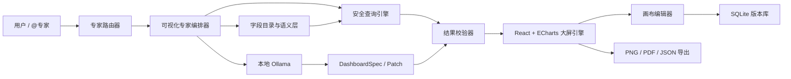

# VISSLM Agent「数据可视化专家」开发方案

## 1. 方案摘要

在现有 VISSLM Agent 中新增一个可通过 `@数据可视化专家` 召唤的内置专家。用户用自然语言描述业务目标后，专家基于本地已采集数据完成：

1. 识别业务场景、受众、时间范围、项目范围和核心指标；
2. 分析可用字段及数据质量；
3. 生成结构化的大屏方案；
4. 通过安全的数据查询引擎计算指标；
5. 在可编辑画布中渲染精美、可交互的数据大屏；
6. 支持继续对话修改、保存版本、导出图片或 PDF。

首版不让大模型直接生成 React、ECharts JavaScript 或 SQL，而是让模型生成受 JSON Schema 约束的 `DashboardSpec`。应用使用确定性的查询引擎执行计算，并通过受控组件库渲染。该路线兼顾生成效果、安全性、可测试性和后续维护成本。

建议首版以 8～10 周完成可用 MVP，团队配置为 1 名前端、1 名 Electron/数据工程师、1 名 AI 工程师、0.5 名产品/设计、0.5 名测试。若由 2 名全栈工程师承担，建议排期 12～14 周。

---

## 2. 当前基础与需要补齐的能力

### 2.1 可复用的现有能力

当前项目已经具备：

- Electron 桌面端和主进程/渲染进程隔离；
- React 19、Ant Design 6、ECharts 6；
- SQLite 本地存储、FTS5 全文检索；
- VISSLM 数据采集、项目/类型筛选、原始 JSON 存储；
- Ollama 本地模型和函数工具调用；
- `search_records`、`get_record_detail`、`aggregate_records` 等基础 Agent 工具；
- 数据来源引用机制。

因此无需重建聊天、模型连接、数据采集和图表底座。

### 2.2 现有实现的主要缺口

- 当前 `aggregate_records` 只支持少量固定统计，不能表达分组、时间趋势、交叉分析、Top N、派生指标等业务查询；
- 原始记录字段是动态 JSON，尚无字段目录、字段类型推断和业务语义层；
- 聊天请求没有专家路由、任务状态、结构化产物和流式进度；
- 当前 Dashboard 是固定页面，尚无大屏 DSL、布局引擎、编辑器和版本管理；
- 缺少生成结果的 Schema 校验、数据校验、视觉校验和自动修复闭环；
- 缺少敏感字段治理、查询资源限制和提示词注入防护。

---

## 3. 产品范围

### 3.1 MVP 必须完成

- 输入框支持键入 `@` 并选择“数据可视化专家”；
- 支持在数据中心选中数据后直接“交给可视化专家”；
- 自动扫描字段、推断类型、展示数据可用性；
- 生成 1 个 16:9 数据大屏，包含标题区、筛选器、指标卡和 3～8 个图表；
- 支持 KPI、柱状图、折线图、饼/环图、排行、表格、进度/仪表、文本洞察；
- 支持项目、类型、时间、枚举字段筛选；
- 支持用自然语言继续修改，例如“换成深色科技风”“把趋势图改成按周”“删除饼图”；
- 支持拖拽、缩放、编辑标题、切换图表类型；
- 自动保存草稿和版本历史；
- 导出 PNG、PDF 和 DashboardSpec JSON；
- 每个组件可查看数据口径、筛选条件和来源范围；
- 生成失败时给出可理解的原因和修复建议。

### 3.2 第二阶段

- 多页驾驶舱、下钻、图表联动；
- 常用业务组件扩展到不少于 10 类，优先覆盖仪表、漏斗、雷达、散点等运营分析场景；
- 属性面板按组件类型提供差异化配置，支持标题、正文、数值字号、边距、圆角、图例、网格、线宽、方向等关键属性；
- 拖拽移动支持左右、上下组件槽位交换，交换过程提供目标高亮、平滑落位和非法布局回退；
- 定时刷新和演示轮播；
- 企业模板、品牌主题、组件模板市场；
- 分享只读链接或发布到服务端；
- 多数据源 JOIN、SQL 数据库和 REST API；
- AI 自动讲解、异常检测、归因分析；
- 团队权限、审批和审计。

### 3.3 MVP 不建议包含

- 允许模型执行任意 SQL 或 JavaScript；
- 让模型生成并动态加载 React 源码；
- 任意 HTML/CSS 注入；
- 多人实时协同；
- 像专业 BI 一样完整的数据建模和 ETL。

---

## 4. 关键用户流程

### 4.1 通过 @ 召唤

1. 用户在 AI 助手输入 `@`；
2. 弹出专家列表，选择“数据可视化专家”；
3. 输入：“基于当前项目做一个版本发布质量大屏，给项目经理看，重点关注缺陷分布和最近 12 周趋势”；
4. 专家先读取字段目录和数据画像；
5. 如果信息足够，直接生成；只有缺少会显著改变结果的信息时才询问，例如无法识别时间字段；
6. 聊天区显示阶段进度：理解需求 → 分析数据 → 规划指标 → 计算数据 → 生成大屏 → 质量检查；
7. 完成后在消息中显示大屏缩略图和“打开画布”按钮。

### 4.2 从数据中心发起

1. 用户选择项目、类型或若干记录；
2. 点击“生成可视化大屏”；
3. 系统将当前筛选条件保存为 `DataScope`；
4. 打开 AI 助手并自动带入 `@数据可视化专家` 和数据范围；
5. 用户只需补充业务目标。

### 4.3 对话式修改

用户的修改不重新生成整个页面，而是产生结构化 Patch：

- “标题改成研发质量驾驶舱” → 修改 `dashboard.title`；
- “柱状图按数量降序” → 修改组件 query 的 sort；
- “整体换成明亮商务风” → 修改 theme；
- “把发布版本和缺陷状态联动” → 增加 filter binding；
- “回到上一个版本” → 恢复历史快照。

每次修改都先校验，再产生新版本，可撤销、可比较。

---

## 5. 总体架构



建议按以下模块拆分：

```text
src/
  shared/
    expert-types.ts
    dashboard-spec.ts
    query-spec.ts
  main/
    experts/
      router.ts
      visualization-agent.ts
      prompts.ts
      tool-registry.ts
    analytics/
      field-profiler.ts
      semantic-layer.ts
      query-validator.ts
      query-engine.ts
    dashboards/
      repository.ts
      validator.ts
      exporter.ts
  renderer/src/
    experts/
      MentionComposer.tsx
      ExpertProgress.tsx
      ArtifactCard.tsx
    dashboard/
      DashboardStudio.tsx
      DashboardCanvas.tsx
      ComponentRenderer.tsx
      InspectorPanel.tsx
      FilterBar.tsx
      themes.ts
```

---

## 6. 专家与 @ 路由设计

### 6.1 专家注册表

不要把专家判断写死在聊天页面，使用注册表：

```ts
interface ExpertDefinition {
  id: 'general' | 'visualization'
  name: string
  mention: string
  description: string
  icon: string
  capabilities: string[]
  allowedTools: string[]
  systemPromptVersion: string
}
```

首版内置：

- `general`：现有数据问答助手；
- `visualization`：数据可视化专家。

### 6.2 路由规则

优先级从高到低：

1. 用户显式 `@数据可视化专家`；
2. 用户从“生成大屏”入口进入；
3. 当前会话已锁定专家；
4. 意图分类器识别“做大屏、图表、看板、驾驶舱、可视化”等意图后建议切换，但不静默改变专家。

ChatRequest 建议扩展为：

```ts
interface ExpertChatRequest {
  conversationId: string
  expertId: string
  question: string
  dataScope?: DataScope
  activeArtifactId?: string
  history: ChatTurn[]
}
```

响应不应只有 Markdown 文本，而应是可组合的事件：

```ts
type AgentEvent =
  | { type: 'status'; stage: string; message: string }
  | { type: 'question'; fields: ClarificationField[] }
  | { type: 'text'; content: string }
  | { type: 'artifact'; artifactId: string; version: number }
  | { type: 'error'; code: string; message: string; recoverable: boolean }
```

Electron IPC 使用事件流或分段回调传递进度，避免用户等待 1～3 分钟只看到“正在思考”。

---

## 7. 数据层与语义层

### 7.1 字段画像

对 `records.raw_json` 中的动态字段建立字段目录。按项目和 nodeType 增量统计：

- 字段路径和展示名；
- 推断类型：string、number、boolean、date、enum、array、object；
- 非空率、唯一值数、最小/最大值；
- Top 枚举值；
- 数值范围；
- 日期范围；
- 示例值；
- 敏感级别；
- 最近画像时间。

建议新增：

```sql
CREATE TABLE field_profiles (
  id TEXT PRIMARY KEY,
  project_id TEXT NOT NULL,
  node_type TEXT NOT NULL,
  field_path TEXT NOT NULL,
  display_name TEXT NOT NULL,
  inferred_type TEXT NOT NULL,
  non_null_rate REAL NOT NULL,
  distinct_count INTEGER NOT NULL,
  min_value TEXT,
  max_value TEXT,
  samples_json TEXT NOT NULL,
  top_values_json TEXT NOT NULL,
  sensitivity TEXT NOT NULL DEFAULT 'normal',
  profiled_at TEXT NOT NULL,
  UNIQUE(project_id, node_type, field_path)
);
```

数据同步完成后只对内容哈希变化的记录更新画像，避免每次全量扫描。

### 7.2 业务语义层

仅有字段类型不足以生成符合业务场景的大屏。需要一个轻量语义层：

```ts
interface SemanticField {
  id: string
  fieldPath: string
  label: string
  role: 'dimension' | 'measure' | 'time' | 'identifier'
  dataType: 'string' | 'number' | 'date' | 'boolean'
  aggregation?: 'count' | 'countDistinct' | 'sum' | 'avg' | 'min' | 'max'
  format?: 'integer' | 'decimal' | 'percent' | 'duration' | 'date'
  synonyms: string[]
  sensitivity: 'normal' | 'internal' | 'sensitive'
}
```

首版使用“规则推断 + 用户确认”：

- `_valm_LastModifyTime` 推断为时间维度；
- UID、ID 类字段推断为标识符；
- 状态、类型、版本等低基数字段推断为维度；
- 数值字段推断为度量；
- 用户可将业务别名保存，如 `_valm_Release` → “发布版本”。

语义层一经确认，后续生成优先复用，能显著提高大屏业务准确度。

### 7.3 DataScope

所有查询都必须绑定数据范围：

```ts
interface DataScope {
  projectIds?: string[]
  nodeTypes?: string[]
  recordUids?: string[]
  baseFilters?: FilterSpec[]
  snapshotAt?: string
}
```

数据范围在 UI 中始终可见，防止用户误以为结果覆盖全部数据。

---

## 8. 安全查询引擎

### 8.1 QuerySpec

模型只能生成 QuerySpec，不接触 SQL：

```ts
interface QuerySpec {
  source: 'records'
  scope: DataScope
  dimensions?: Array<{
    field: string
    timeGrain?: 'day' | 'week' | 'month' | 'quarter'
  }>
  measures: Array<{
    id: string
    field?: string
    aggregation: 'count' | 'countDistinct' | 'sum' | 'avg' | 'min' | 'max'
  }>
  filters?: FilterSpec[]
  sort?: Array<{ field: string; direction: 'asc' | 'desc' }>
  limit?: number
}
```

查询处理链路：

1. JSON Schema 校验；
2. 校验字段是否存在于字段目录；
3. 校验字段类型与聚合方式是否兼容；
4. 注入 DataScope 和敏感字段策略；
5. 估算扫描成本并限制行数、分组数和执行时间；
6. 使用参数化 SQLite 查询；
7. 返回统一 Dataset；
8. 对结果进行空值、异常值和总计一致性检查。

### 8.2 首版建议支持的分析能力

- 记录数、去重计数；
- sum、avg、min、max；
- 单维/双维分组；
- 日、周、月、季度趋势；
- Top N 与“其他”；
- 同比/环比；
- 占比；
- 累计值；
- 基于条件的计数，例如“未关闭缺陷数”。

派生指标采用白名单表达式 AST，不使用 `eval`：

```ts
type MetricExpression =
  | { op: 'measure'; id: string }
  | { op: 'literal'; value: number }
  | { op: 'add' | 'subtract' | 'multiply' | 'divide'; left: MetricExpression; right: MetricExpression }
```

### 8.3 资源限制

- 单组件查询超时：MVP 5 秒；
- 单次生成最多 12 个查询；
- 单查询分组结果最多 500 行；
- 导出明细最多 10,000 行；
- 同一 Dashboard 并发查询不超过 4；
- 使用查询结果缓存，key 为 `QuerySpec hash + data snapshot hash`；
- 数据同步后按受影响范围失效缓存。

---

## 9. DashboardSpec：生成与渲染契约

### 9.1 设计原则

- Schema 有版本号；
- 模型只能使用组件白名单、主题 token 和栅格布局；
- 数据查询与视觉配置分离；
- 每个组件都可独立校验和降级；
- Spec 能持久化、diff、回滚和迁移。

### 9.2 核心结构

```ts
interface DashboardSpec {
  schemaVersion: '1.0'
  id: string
  title: string
  subtitle?: string
  businessContext: {
    audience: string
    objective: string
    scopeDescription: string
  }
  viewport: { width: 1920; height: 1080; columns: 24; rowHeight: number }
  theme: DashboardTheme
  globalFilters: DashboardFilter[]
  components: DashboardComponent[]
  generatedAt: string
}

interface DashboardComponent {
  id: string
  type: 'kpi' | 'bar' | 'line' | 'pie' | 'ranking' | 'table' | 'gauge' | 'insight'
  title: string
  description?: string
  layout: { x: number; y: number; w: number; h: number }
  query: QuerySpec
  encoding: {
    x?: string
    y?: string
    series?: string
    value?: string
    label?: string
  }
  style?: Record<string, unknown>
  interactions?: {
    filterOnClick?: boolean
    drilldownField?: string
  }
}
```

### 9.3 图表选择规则

- 时间 + 单指标：折线图或面积图；
- 类别比较：横/纵向柱状图；
- 排名且类别较多：横向排行条形图；
- 构成且类别不超过 6：环图；
- 构成类别超过 6：堆叠条形图或排行；
- 单一关键指标：KPI 卡；
- 目标完成率：进度条或仪表，仪表最多 1～2 个；
- 明细核查：表格；
- 禁止 3D 图表、彩虹色滥用、低可读性装饰。

### 9.4 主题系统

MVP 内置 4 套经过设计验收的主题：

- 深色科技；
- 深色稳重；
- 明亮商务；
- 明亮简洁。

模型只选择主题和少量语义 token，不生成任意 CSS。主题应统一控制背景、卡片、正文、弱文本、边框、强调色、图表色板、阴影、圆角和间距。

页面美观的关键不是让模型自由设计，而是提供高质量组件、合理默认布局和严格视觉规则。

---

## 10. AI 编排流程

### 10.1 分阶段生成

不要用一个超长 Prompt 一次完成。建议编排为：

1. `Intent`：提取受众、目标、范围、时间、风格；
2. `Profile`：调用字段目录和数据画像工具；
3. `Plan`：生成指标与图表规划，不含具体样式；
4. `Query`：生成并验证 QuerySpec；
5. `Execute`：由查询引擎计算真实数据；
6. `Compose`：根据真实结果生成 DashboardSpec；
7. `Validate`：Schema、数据、布局、视觉规则检查；
8. `Repair`：只修复失败组件；
9. `Persist`：保存大屏及生成审计信息。

### 10.2 可视化专家工具

建议新增以下函数工具：

- `get_data_scope_summary`
- `list_field_profiles`
- `get_field_profile`
- `list_semantic_fields`
- `preview_query`
- `execute_query`
- `validate_dashboard_spec`
- `save_dashboard`
- `get_dashboard`
- `patch_dashboard`

工具参数全部使用 JSON Schema，工具返回值限制长度；大数据结果只返回统计摘要和有限样本，完整数据不进入模型上下文。

### 10.3 澄清策略

仅在以下情况询问：

- 没有可识别的数据范围；
- 找不到用户要求的核心业务字段；
- 多个时间字段含义不同且会导致明显不同结果；
- 目标用户或业务目标完全未知，无法确定指标；
- 用户要求的指标无法从当前数据计算。

其他信息使用合理默认值，并在生成结果中明确标记假设。例如：“默认使用最后修改时间作为趋势时间”。

### 10.4 模型适配

当前 `qwen3:8b` 可用于意图提取、字段匹配和基础 Spec 生成，但复杂大屏的稳定性应通过以下手段保证：

- 每一步都使用较小、明确的 JSON Schema；
- temperature 设为 0～0.2；
- 将字段目录裁剪到相关 nodeType；
- 用 3～5 个高质量 few-shot 示例；
- 失败后基于校验错误做局部修复；
- 记录模型、Prompt 版本和输出，建立回归集。

模型层应封装为 `ModelProvider`，避免业务逻辑绑定 Ollama，后续可接入企业模型服务。

---

## 11. 编辑器与交互设计

建议新增侧边栏入口“可视化大屏”，页面结构为：

```text
┌──────────────── 顶部工具栏：保存 / 撤销 / 预览 / 导出 ────────────────┐
│ 大屏列表 │                   画布                    │ 属性面板     │
│          │  筛选器   KPI  KPI  KPI                  │ 标题/图表    │
│          │  趋势图          状态分布                │ 数据/样式    │
│          │  排行榜          明细表                  │ 交互/口径    │
└────────────────────────────────────────────────────────────────────┘
```

编辑能力分层：

- 默认模式：自然语言修改和模板级操作；
- 简单编辑：拖拽、缩放、标题、图表类型、颜色；
- 高级面板：维度、指标、聚合、筛选、排序、Top N；
- 数据口径抽屉：QuerySpec 的中文解释、来源范围、刷新时间；
- 预览模式：隐藏编辑控件，适配 16:9 和全屏。

布局建议使用 24 列网格并自动吸附。模型生成后运行布局校验：

- 不重叠；
- 不越界；
- 标题区固定高度；
- KPI 卡同排同高；
- 图表最小宽高；
- 表格至少占 8 列；
- 首屏组件不超过 10 个。

---

## 12. 持久化与版本管理

建议新增表：

```sql
CREATE TABLE dashboards (
  id TEXT PRIMARY KEY,
  title TEXT NOT NULL,
  description TEXT NOT NULL DEFAULT '',
  expert_id TEXT NOT NULL,
  current_version INTEGER NOT NULL,
  data_scope_json TEXT NOT NULL,
  created_at TEXT NOT NULL,
  updated_at TEXT NOT NULL
);

CREATE TABLE dashboard_versions (
  dashboard_id TEXT NOT NULL,
  version INTEGER NOT NULL,
  spec_json TEXT NOT NULL,
  change_summary TEXT NOT NULL,
  prompt TEXT NOT NULL DEFAULT '',
  model_name TEXT NOT NULL DEFAULT '',
  prompt_version TEXT NOT NULL DEFAULT '',
  created_at TEXT NOT NULL,
  PRIMARY KEY(dashboard_id, version),
  FOREIGN KEY(dashboard_id) REFERENCES dashboards(id) ON DELETE CASCADE
);

CREATE TABLE query_cache (
  cache_key TEXT PRIMARY KEY,
  result_json TEXT NOT NULL,
  data_snapshot TEXT NOT NULL,
  expires_at TEXT NOT NULL,
  created_at TEXT NOT NULL
);
```

会话和大屏产物分离：聊天消息可删除，但已保存的大屏不应随会话丢失。

---

## 13. 安全与治理

### 13.1 必须执行

- 模型永远不获得数据库文件路径、Token 或系统路径；
- 禁止任意 SQL、JS、HTML、CSS 和文件读写工具；
- QuerySpec 白名单校验、参数化 SQL、超时和结果行数限制；
- `raw_json` 中的文本均视为不可信数据，不允许其内容改变系统指令；
- 明确区分“用户指令”和“数据内容”，防止提示词注入；
- 对邮箱、手机号、姓名、Token 等字段做敏感识别；
- 默认不在图表标签、导出文件中展示敏感明细；
- 导出前提示数据范围和敏感字段；
- 日志不记录完整数据集和 Token；
- 保存生成审计：用户请求、专家、模型、Prompt 版本、工具调用、Spec 版本、错误；非保存操作使用属性排序后的稳定 Spec SHA-256 指纹追踪上下文，避免重复持久化完整 Spec，组件修复同时记录源/结果指纹。

### 13.2 Electron 侧

- 保持 `contextIsolation: true`；
- 仅通过 preload 暴露强类型 IPC；
- IPC 主进程再次校验所有 DashboardSpec 和 QuerySpec；
- 导出路径由系统保存对话框选择；
- HTML 预览继续使用严格白名单，禁止远程脚本。

---

## 14. 质量体系

### 14.1 四层校验

1. **结构校验**：DashboardSpec 和 QuerySpec 符合 Schema；
2. **数据校验**：字段存在、类型兼容、聚合结果可复算；
3. **业务校验**：指标口径、数据范围、时间字段和单位明确；
4. **视觉校验**：无重叠、无截断、色彩可辨、图表选择合理。

### 14.2 测试策略

单元测试：

- 字段类型推断；
- QuerySpec → SQL 编译；
- 筛选、聚合、同比环比；
- Schema 校验和迁移；
- 布局碰撞检测；
- Patch 合并和版本回滚。

集成测试：

- @ 路由到正确专家；
- 从数据中心携带 DataScope；
- 生成 → 查询 → 渲染 → 保存完整链路；
- 数据同步后缓存失效；
- 单组件失败时局部降级；
- 导出 PNG/PDF。

AI 回归集至少包含 50 个固定场景：

- 数据为空；
- 字段缺失；
- 中文字段和英文 Key 混用；
- 多个日期字段；
- 枚举值过多；
- 数值字段以字符串存储；
- 用户要求不可计算指标；
- 数据内容包含“忽略之前指令”等注入文本；
- 大屏增删改和连续多轮修改。

视觉回归：

- 1920×1080、1366×768、4K；
- 4 套主题；
- 12 种组件；
- 长标题、长标签、空数据和极端数值；
- 截图 diff 和人工设计验收。

当前实现分为两层，不能互相替代：

- `src/shared/dashboard-visual-regression.ts` 和 `smoke:dashboard-visual-matrix` 是合成布局矩阵，覆盖 1366×768、1920×1080 和 4K 的边界、重叠、最小尺寸与标题截断检查，不产生真实像素；
- `smoke:dashboard-electron-visual` 启动独立 Electron，在 `dashboard-capture-mode` 下使用固定黄金数据截取真实画布，并与 `tests/visual-baselines/dashboard` 中的 PNG 基线做 diff；`smoke:dashboard-electron-visual-matrix` 默认覆盖 1366×768、1920×1080 和 3840×2160，fixture 数据写入临时 userData，运行产物写入临时目录，不使用真实业务数据；
- 真实截图门禁允许原生字体/Canvas 抗锯齿造成不超过 1% 的像素差异；修改布局、组件内容或主题导致的结构性变化仍必须更新基线并经过人工验收；
- 固定 Windows Electron 三视口真实基线已进入发布门禁，多操作系统字体栈和显卡差异仍列入阶段 5，不与 Windows 基线混用。

### 14.3 MVP 验收指标

- 80% 以上测试问题可一次生成可用大屏；
- 95% 以上 QuerySpec 可通过自动校验或一次自动修复；
- 所有数字均可追溯到 DataScope 和 QuerySpec；
- 典型 5 万条记录下，单图查询 P95 < 2 秒；
- 首次生成 P95 < 90 秒；
- 二次自然语言修改 P95 < 30 秒；
- 0 个任意代码执行入口；
- 1366×768 以上分辨率无组件重叠或关键文字截断。

---

## 15. 分阶段开发计划

### 阶段 0：需求与样例冻结（第 1 周）

产出：

- 选定 3 个真实业务场景；
- 每个场景准备脱敏样例数据和人工黄金大屏；
- 确定字段别名、指标口径和 4 套主题；
- 冻结 DashboardSpec v1 和 QuerySpec v1。

退出条件：产品、业务、设计和研发对 3 个黄金样例达成一致。

### 阶段 1：数据分析底座（第 2～3 周）

开发：

- 字段画像和增量更新；
- 轻量语义层；
- QuerySpec 校验、编译和执行；
- 缓存与资源限制；
- 单元测试。

退出条件：黄金样例中的指标无需手写 SQL，均可由 QuerySpec 正确计算。

### 阶段 2：大屏引擎（第 3～5 周，可与阶段 1 部分并行）

开发：

- DashboardSpec；
- 不少于 10 类受控组件，当前目标为 12 类；
- 4 套主题；
- 24 列画布、布局校验；
- 筛选器、数据口径抽屉；
- 保存、版本、预览、PNG 导出。

退出条件：人工编写 Spec 能完整还原 3 个黄金大屏。

### 阶段 3：专家编排（第 5～7 周）

开发：

- @Mention 组件和专家注册表；
- 可视化专家 Prompt；
- 多阶段工具调用；
- 结构化事件与进度；
- 自动校验、局部修复；
- Artifact 卡片和打开画布。

退出条件：3 个黄金场景可以从自然语言稳定生成，不需要研发介入。

### 阶段 4：编辑、导出与治理（第 7～8 周）

开发：

- 对话式 Patch；
- 大屏页内 AI 对话抽屉：默认携带当前 DashboardSpec 和 artifact 版本，选中组件后将 `focusComponentId` 传给 Agent，并限制 Patch 只能作用于该组件；
- 连续 Patch 版本链路：每次生成/修改返回 artifact 版本，聊天消息和历史会话持久化版本，下一次修改使用上一版本作为输入；失败时继续沿用现有校验、回滚和不提交链路；
- 拖拽缩放、左右/上下槽位交换和差异化属性面板；
- 通用样式配置与组件类型专属配置，所有属性写入 DashboardSpec 并参与校验；
- 图表类型切换采用原子适配：同步调整 QuerySpec、编码、数据结果与最小布局，查询失败时保留原组件；
- 质量抽屉支持工作台单组件确定性修复：仅修复目标组件的失效字段、维度、指标、编码、数据和必要布局，查询执行与整屏校验全部通过后原子提交，失败时保持原大屏；
- 数据配置面板按单值、分类、时序、双指标、明细和文本形态展示对应字段，手动数据支持增删与逐项编辑；
- 组件选中时仅显示组件属性，点击画布空白区域失焦后显示大屏标题、副标题和全局筛选器；
- 撤销、版本恢复；
- 版本恢复需明确提示将覆盖当前画布，恢复过程中禁止重复提交，并以新版本记录恢复结果；
- PDF/JSON 导出；
- 敏感字段策略和审计日志。
- 可视化 Agent 运行审计记录生成/修改模式，以及字段画像、模型编排、结构校验、查询执行、Patch 应用和自动修复的顺序、状态、耗时与数量型摘要；不持久化 Prompt 正文、查询结果行和筛选值。
- Spec 快照策略：Dashboard 版本保留完整可恢复 Spec；诊断、导出、修复等非版本操作记录稳定 SHA-256 指纹，修复记录 `sourceSpecHash` 与结果 `specHash`，只在需要恢复时读取版本快照。
- 真实 Electron 截图门禁：固定黄金数据、等待画布布局稳定和图表动画完成后捕获 1366×768、1920×1080、3840×2160 画布，使用 PNG baseline diff 阻断结构性视觉回归；

当前 P0 已完成：可视化大屏页内对话、指定组件修改隔离、artifact 版本连续传递和失败回滚保持在现有 DashboardSpec/Patch 链路内。`smoke:dashboard-ai-context` 覆盖连续两次成功 Patch、第二次基于第一次结果、指定组件修改以及跨组件/整屏操作拦截；TypeScript、生产构建和 Dashboard/项目管理逻辑 smoke 已通过。

阶段 5 已完成固定 Windows Electron 环境的三视口真实截图基线和 check-only 门禁：3 套黄金大屏 × 3 个视口共 9 项均通过，基线文件位于 `tests/visual-baselines/dashboard`，命令为 `smoke:dashboard-electron-visual-matrix`。多操作系统字体栈、显卡差异和真实用户试点仍保留为发布前验收项。

退出条件：用户可完成“生成—修改—保存—导出”闭环。

### 阶段 5：试点与优化（第 9～10 周）

- 扩展真实 Electron 截图基线到多操作系统字体环境，并保留平台专属基线（固定 Windows 三视口基线已完成）；
- 5～10 名真实用户试点；
- 补齐 AI 回归集；
- 优化 Prompt、模板、查询性能和视觉细节；
- 编写用户手册和故障诊断；
- 冻结 MVP 发布版本。

---

## 16. 人力与工作量估算

| 角色 | 建议投入 | 主要职责 |
|---|---:|---|
| 产品/业务分析 | 0.5 人 | 场景、指标口径、验收 |
| UI/UX 设计 | 0.5 人 | 大屏模板、主题、编辑器体验 |
| 前端工程师 | 1 人 | 画布、组件、交互、导出 |
| Electron/数据工程师 | 1 人 | SQLite、查询引擎、IPC、缓存 |
| AI 工程师 | 1 人 | 专家编排、Schema、Prompt、评测 |
| 测试工程师 | 0.5 人 | 功能、性能、视觉、AI 回归 |

粗略工作量为 22～28 人周。若只做“生成后不可编辑”的演示版，可压缩到 4～5 周，但不建议将其作为正式可交付版本。

---

## 17. 主要风险与应对

| 风险 | 表现 | 应对 |
|---|---|---|
| 动态 JSON 字段不稳定 | 同名字段类型不一致 | 字段画像按项目+类型隔离，保留冲突率 |
| 本地 8B 模型结构化输出不稳 | Schema 错误、字段幻觉 | 小步骤 Schema、校验、局部修复、few-shot |
| 业务指标口径不明确 | 图好看但数字无意义 | 语义层、口径抽屉、黄金样例、用户确认 |
| 数据规模增长 | SQLite 扫描慢 | JSON 表达式索引、画像表、缓存；后续迁移 DuckDB/PostgreSQL |
| 大屏“千篇一律” | 视觉重复 | 4 套高质量主题、场景模板、布局变体 |
| 模型上下文过大 | 响应慢或失败 | 只传字段摘要和查询结果摘要，不传全量记录 |
| 对话修改破坏已有页面 | 全量重生成 | 结构化 Patch、版本快照、局部验证 |

对于分析查询规模明显超过几十万至百万行、且需要多字段扫描的场景，可在第二阶段引入 DuckDB 作为本地 OLAP 引擎；MVP 先用 SQLite，避免过早增加部署复杂度。

---

## 18. 建议立即确定的业务决策

以下问题会影响首版设计，建议在阶段 0 明确：

1. 首批服务的 3 个业务场景是什么，例如研发质量、测试进度、需求交付还是项目管理？
2. 首版数据是否全部来自当前 VISSLM 本地采集库，还是必须接 Excel、数据库或 REST API？
3. 大屏主要用于桌面内查看、会议室 16:9 展示，还是需要发布分享链接？
4. 数据规模上限大约是多少：记录数、字段数、单次项目数？
5. 是否存在必须隐藏的字段和分角色权限？
6. 必须支持哪些导出格式：PNG、PDF、PPT、独立 HTML？
7. 生成的大屏是否需要回写 VISSLM 平台？
8. 是否必须全离线运行，还是允许配置云端大模型以提升复杂场景质量？

在这些答案尚未确定前，推荐默认假设为：单机本地、数据仅来自现有采集库、5 万条以内、会议 16:9 展示、PNG/PDF 导出、无多人分享、全离线 Ollama。

---

## 19. 推荐的第一批开发任务

第一迭代不要先改 Prompt，而应先完成可验证的底座：

1. 定义 `DataScope`、`FieldProfile`、`SemanticField`、`QuerySpec`、`DashboardSpec`；
2. 为 SQLite 增加字段画像和 Dashboard 版本表；
3. 实现 10 个固定 QuerySpec 测试用例；
4. 使用人工 Spec 渲染第一个黄金大屏；
5. 完成 `@数据可视化专家` 路由和 Artifact 消息结构；
6. 最后接入 Ollama 生成 Plan、QuerySpec 和 DashboardSpec。

这样每一层都能独立验收；即使模型效果暂时不理想，人工模板和编辑器仍然是可用产品，而不是一次性演示。
