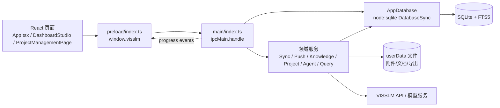

# 01 代码映射

> 最后分析时间：2026-08-01  
> 代码基线：Git `9bab57fc5166770784c1855857a6e1a8ebaa6200`；当前工作树含未提交改动。  
> 读取顺序：先看 `docs/00-project-scan.md`，再看本文件；数据结构详见 `docs/05-database-design.md`，IPC 契约详见 `docs/06-api-design.md`。

## 1. 调用链总览

项目没有 HTTP Controller、REST 路由、DAO 目录或独立服务器。以下映射中的“Controller”统一指 IPC handler，“DAO”统一指 `AppDatabase` 的相应方法。

## 2. 前端页面 -> 路由键 -> API

应用是单窗口单页导航，不使用 React Router。页面键由 `src/renderer/src/App.tsx:110-145,3895-4118` 定义，功能开关和导航顺序由 `settings` 返回后过滤。

| 页面/组件 | 页面键/入口 | 主要 API 调用 | 结果用途 |
|---|---|---|---|
| `DashboardPage` | `dashboard` | `getStats` | 指标卡、类型/项目/发布状态图表 |
| `AssetCenterPage` | `data` | `listRecords`、`listProjects`、`listNodeTypes`、`getRecord`、`importData`、`exportData`、`deleteData` | 数据资产表、记录详情、批量数据操作 |
| `KnowledgeBasePage` | `data` 内部 Tab | `listKnowledgeDocuments`、`getKnowledgeStats`、`uploadKnowledgeDocuments`、`getKnowledgeDocument`、`getKnowledgeDocumentPreview`、`retryKnowledgeDocument`、`updateKnowledgeDocumentTags`、`deleteKnowledgeDocument`、`rebuildKnowledgeIndex` | 文档上传、状态、标签、分块/协议预览、重建索引 |
| `ChatPage` | `chat` | `listChatSessions`、`getChatSession`、`saveChatSession`、`deleteChatSession`、`getRecord`、`getKnowledgeDocument`、`askAgent` | 会话历史、AI 问答、来源/数据视图、详情抽屉 |
| `SyncPage` | `sync` | `getSyncConfig`、`saveSyncConfig`、`previewSync`、`startSync`、`listCollectionRequestLogs`、`onSyncProgress` | 采集范围配置、预览、同步和请求日志 |
| `PushPage` | `push` | `listRecords`、`listPushLogs`、`previewPush`、`startPush` | 推送记录选择、映射、预览、执行、日志 |
| `SettingsPage` | `settings` | `getSettings`、`testPlatform`、`savePlatformSettings`、`testModel`、`saveModelSettings`、`saveFeatureSettings`、`saveNavigationOrder` | 平台/模型连接和工作台配置 |
| `DashboardStudio` | `visualization` | `listDashboards`、`getStats`、`listFieldProfiles`、`saveFieldProfileSemantics`、`executeQuery`、`saveDashboard`、`getDashboard`、`listDashboardVersions`、`restoreDashboard`、`diagnoseDashboard`、`listVisualizationRuns`、`listDashboardAuditLogs`、三种导出、`askAgent` 间接生成 | 查询驱动的大屏编辑、版本和导出 |
| `ProjectManagementPage` | `projects` | 项目/组织/需求/匹配/成本/资产/参与人/计划全套 `projects:*` 和 `organization:*` API | 项目列表、详情 Tabs、协议分析、需求审核发布、匹配抽屉 |
| `WindowTitleBar` | 全局 | `isWindowMaximized`、`onWindowMaximized`、`minimizeWindow`、`toggleMaximizeWindow`、`closeWindow` | 无边框窗口控制 |

## 3. API -> IPC handler -> 服务/数据库映射

### 3.1 窗口、设置和连接

| IPC 通道 | preload 方法 | Controller/处理器 | Service/DAO | 数据/外部依赖 |
|---|---|---|---|---|
| `window:minimize` | `minimizeWindow` | `index.ts:123` | `BrowserWindow.minimize` | Electron 窗口 |
| `window:toggle-maximize` | `toggleMaximizeWindow` | `index.ts:124-128` | `BrowserWindow.maximize/unmaximize` | 窗口状态 |
| `window:close` | `closeWindow` | `index.ts:129` | `BrowserWindow.close` | 窗口生命周期 |
| `window:is-maximized` | `isWindowMaximized` | `index.ts:130` | `BrowserWindow.isMaximized` | 窗口状态 |
| `settings:get` | `getSettings` | `index.ts:132` | `SettingsService.getAll` | `settings` |
| `settings:save-platform` | `savePlatformSettings` | `index.ts:133-135` | `SettingsService.savePlatform` | `settings.platform.*`，safeStorage |
| `settings:save-model` | `saveModelSettings` | `index.ts:136-138` | `SettingsService.saveModel` | `settings.model.*`，safeStorage |
| `settings:save-features` | `saveFeatureSettings` | `index.ts:139-141` | `SettingsService.saveFeatures` | `settings.feature.*` |
| `settings:save-navigation-order` | `saveNavigationOrder` | `index.ts:142-144` | `SettingsService.saveNavigationOrder` | `settings.navigation.order` |
| `connections:test-platform` | `testPlatform` | `index.ts:146-149` | `VisslmClient.test` | VISSLM API |
| `connections:test-model` | `testModel` | `index.ts:151-154` | `OllamaAgent.test` -> `ModelClient.test` | Ollama/在线模型服务 |

### 3.2 数据、采集和推送

| IPC 通道 | preload 方法 | Controller/处理器 | Service/DAO | 数据/外部依赖 |
|---|---|---|---|---|
| `data:projects` | `listProjects` | `index.ts:156` | `AppDatabase.listProjects` | `projects`、`records` |
| `data:node-types` | `listNodeTypes` | `index.ts:157` | `AppDatabase.listNodeTypes` | `records.node_type` |
| `data:records` | `listRecords` | `index.ts:158` | `AppDatabase.listRecords` | `records`、`images`、FTS5 |
| `data:record` | `getRecord` | `index.ts:159` | `AppDatabase.getRecord` | `records`、`images` |
| `data:stats` | `getStats` | `index.ts:160` | `AppDatabase.getStats` | `projects`、`records`、`images`、推送状态 |
| `sync:get-config` | `getSyncConfig` | `index.ts:161` | `SettingsService.getSyncConfig` | `settings.sync.scope` |
| `sync:save-config` | `saveSyncConfig` | `index.ts:162-164` | `SettingsService.saveSyncConfig` | `settings.sync.scope` |
| `sync:preview` | `previewSync` | `index.ts:165-169` | `VisslmClient.previewScope` | VISSLM API；不写同步表 |
| `sync:start` | `startSync` | `index.ts:170-178` | `SyncService.run` -> `VisslmClient.queryItems/getAttachments` | `sync_runs`、`collection_request_logs`、`projects`、`records`、`images`、知识索引 |
| `sync:request-logs` | `listCollectionRequestLogs` | `index.ts:179-181` | `AppDatabase.listCollectionRequestLogs` | `collection_request_logs` |
| `data:import` | `importData` | `index.ts:558-615` | `AppDatabase.importRows`，随后 `KnowledgeService.syncRecordIndex`、`markMatchesStale` | 用户选择 JSON/JSONL；`records/images` |
| `data:export` | `exportData` | `index.ts:517-556` | `AppDatabase.exportRows` + 文件对话框 | JSONL 文件；审计表复用 |
| `data:delete` | `deleteData` | `index.ts:617-621` | `AppDatabase.deleteData`，随后索引同步/匹配失效 | `records`、级联 `images`/知识索引/匹配 |
| `push:preview` | `previewPush` | `index.ts:841` | `PushService.preview` | 本地记录；不写推送日志 |
| `push:start` | `startPush` | `index.ts:842` | `PushService.push` -> `VisslmClient.createItem` | VISSLM POST；`push_logs`、`records.push_*` |
| `push:logs` | `listPushLogs` | `index.ts:843-845` | `AppDatabase.listPushLogs` | `push_logs` |
| `sync:progress` | `onSyncProgress` | 主进程 `webContents.send` `index.ts:875-879` | `SyncService` 回调 | 渲染层进度事件 |

### 3.3 AI、知识库和分析

| IPC 通道 | preload 方法 | Controller/处理器 | Service/DAO | 数据/外部依赖 |
|---|---|---|---|---|
| `chat:sessions` | `listChatSessions` | `index.ts:182` | `AppDatabase.listChatSessions` | `chat_sessions` |
| `chat:session` | `getChatSession` | `index.ts:183` | `AppDatabase.getChatSession` | `chat_sessions` |
| `chat:save-session` | `saveChatSession` | `index.ts:184-186` | `AppDatabase.saveChatSession` | `chat_sessions` |
| `chat:delete-session` | `deleteChatSession` | `index.ts:187-189` | `AppDatabase.deleteChatSession` | `chat_sessions` |
| `agent:ask` | `askAgent` | `index.ts:190-264` | `ExpertRouter`；通用 `OllamaAgent`，可视化 `VisualizationAgent`；`QueryEngine`/`KnowledgeService`/`AppDatabase` | 模型服务、本地记录/文档、大屏运行记录 |
| `agent:event` | `onAgentEvent` | 主进程通过 `webContents.send` | `VisualizationAgent` 事件回调 | 渲染层专家进度事件 |
| `analytics:field-profiles` | `listFieldProfiles` | `index.ts:266-268` | `QueryEngine.profile` -> `AppDatabase.get/saveFieldProfiles` | `field_profiles`、`query_cache`、`records` |
| `analytics:field-profile-semantics` | `saveFieldProfileSemantics` | `index.ts:269-273` | `QueryEngine.updateFieldProfileSemantics` -> `AppDatabase.updateFieldProfileSemantics` | `field_profiles` |
| `analytics:execute-query` | `executeQuery` | `index.ts:274-276` | `QueryEngine.execute` -> `AppDatabase.scanAnalyticsRecords` | `records`、`field_profiles`、`query_cache` |
| `knowledge:documents` | `listKnowledgeDocuments` | `index.ts:623-625` | `AppDatabase.listKnowledgeDocuments` | `knowledge_documents` |
| `knowledge:document` | `getKnowledgeDocument` | `index.ts:626` | `AppDatabase.getKnowledgeDocument` | `knowledge_documents/chunks` |
| `knowledge:document-preview` | `getKnowledgeDocumentPreview` | `index.ts:627-641` | `AppDatabase.getKnowledgeDocument` + `readFileSync`（PDF base64） | `knowledge_documents.file_path` |
| `knowledge:upload` | `uploadKnowledgeDocuments` | `index.ts:643-665` | 文件对话框 -> `KnowledgeService.processFiles` | 本地文件、`knowledge_*`、embedding/OCR |
| `knowledge:retry` | `retryKnowledgeDocument` | `index.ts:666` | `KnowledgeService.retryDocument` | `knowledge_documents/chunks/vectors` |
| `knowledge:tags` | `updateKnowledgeDocumentTags` | `index.ts:667-669` | `KnowledgeService.updateDocumentTags` -> DB update | `knowledge_documents.tags_json` |
| `knowledge:delete` | `deleteKnowledgeDocument` | `index.ts:670` | `KnowledgeService.deleteDocument` -> DB delete/文件处理 | `knowledge_*`、源文件路径 |
| `knowledge:rebuild` | `rebuildKnowledgeIndex` | `index.ts:671` | `KnowledgeService.rebuildIndex` | `knowledge_chunks/vectors`、embedding |
| `knowledge:stats` | `getKnowledgeStats` | `index.ts:672` | `AppDatabase.getKnowledgeStats` | `knowledge_*`、`records` |
| `knowledge:progress` | `onKnowledgeProgress` | 主进程回调 `index.ts:864-868` | `KnowledgeService.emit` | `knowledge_index_tasks`、渲染层事件 |

### 3.4 Dashboard 和导出

| IPC 通道 | preload 方法 | Controller/处理器 | Service/DAO | 数据/外部依赖 |
|---|---|---|---|---|
| `dashboards:list` | `listDashboards` | `index.ts:277` | `AppDatabase.listDashboards` | `dashboards` |
| `dashboards:get` | `getDashboard` | `index.ts:278-280` | `AppDatabase.getDashboard` | `dashboards/dashboard_versions` |
| `dashboards:versions` | `listDashboardVersions` | `index.ts:281-283` | `AppDatabase.listDashboardVersions` | `dashboard_versions` |
| `dashboards:save` | `saveDashboard` | `index.ts:284-309` | `validateDashboardSpec` -> `AppDatabase.saveDashboard` -> `recordDashboardAudit` | `dashboards/dashboard_versions/dashboard_audit_logs` |
| `dashboards:restore` | `restoreDashboard` | `index.ts:310-331` | `AppDatabase.restoreDashboard` -> 审计 | 版本表/审计表 |
| `dashboards:diagnose` | `diagnoseDashboard` | `index.ts:332-355` | `diagnoseDashboard` + `QueryEngine` -> 审计 | `records`、查询缓存、审计表 |
| `dashboards:runs` | `listVisualizationRuns` | `index.ts:356-358` | `AppDatabase.listVisualizationRuns` | `visualization_runs` |
| `dashboards:audit-logs` | `listDashboardAuditLogs` | `index.ts:359-361` | `AppDatabase.listDashboardAuditLogs` | `dashboard_audit_logs` |
| `dashboards:export-json` | `exportDashboardJson` | `index.ts:362-404` | 校验 + Electron 保存对话框 + `writeFileSync` + 审计 | JSON 文件/审计 |
| `dashboards:export-pdf` | `exportDashboardPdf` | `index.ts:405-454` | 校验 + `webContents.printToPDF` + 审计 | PDF 文件/审计 |
| `dashboards:export-png` | `exportDashboardPng` | `index.ts:455-516` | 校验 + base64 PNG 签名/50 MB 校验 + 写文件 + 审计 | PNG 文件/审计 |

### 3.5 项目管理与组织

| IPC 通道 | preload 方法 | Controller/处理器 | Service/DAO | 数据表 |
|---|---|---|---|---|
| `projects:list/get/documents` | `listManagedProjects` / `getManagedProject` / `listManagedProjectDocuments` | `index.ts:673-677` | `ProjectManagementService.listProjects/getProject/listProjectDocuments` | `pm_projects`、`pm_project_documents`、`knowledge_documents`、需求统计 |
| `projects:create/update/delete` | 同名方法 | `index.ts:678-684` | `ProjectManagementService.createProject/updateProject/deleteProject` | `pm_projects` |
| `projects:export-data` / `projects:export-excel` / `projects:import-data` | `exportManagedProjectData` / `exportManagedProjectExcel` / `importManagedProjectData` | `index.ts:753-828` | 服务生成项目快照；JSON 直接写文件，Excel 由 `createProjectWorkbook` 生成多工作表；导入解析 JSON | 项目关联全部 `pm_*`、`records`、`knowledge_*` |
| `projects:discard-draft/confirm` | 同名方法 | `index.ts:731-734` | 服务草稿清理/确认；确认后可触发匹配 | `pm_projects`、需求/匹配 |
| `projects:upload-agreement` | `startProjectTechnicalAgreementUpload` | `index.ts:735-745` | 文件对话框 -> `ProjectManagementService.startTechnicalAgreement` | `knowledge_*`、`pm_project_documents`、`pm_requirement_sets`、`pm_requirements` |
| `projects:retry-analysis` | `retryProjectAnalysis` | `index.ts:746` | 服务重试 -> `KnowledgeService` + 模型分析 | `pm_projects`、`pm_analysis_runs` |
| `projects:start-matching` | `startProjectMatching` | `index.ts:747` | 服务异步 `runMatching` | `pm_projects`、`pm_requirements`、`pm_requirement_matches`、知识向量 |
| `projects:requirements/requirement-set` | `listProjectRequirements/getProjectRequirementSet` | `index.ts:748-753` | 服务列表/审核集查询 | `pm_requirements`、`pm_requirement_sets` |
| `projects:requirement-create/update` | 同名方法 | `index.ts:754-759` | 规范化输入 -> DB review 版本写入 | `pm_requirements` |
| `projects:requirement-split/merge` | 同名方法 | `index.ts:760-765` | 服务校验 + DB 拆分/合并 | `pm_requirements` |
| `projects:requirement-review` | `reviewProjectRequirements` | `index.ts:766-768` | 批量审核状态更新 | `pm_requirements` |
| `projects:requirements-publish` | `publishProjectRequirements` | `index.ts:769-771` | 发布审核集；活动项目可启动匹配 | `pm_requirement_sets`、`pm_requirements`、匹配表 |
| `projects:requirement-delete/status/key-info-terms` | 同名方法 | `index.ts:772-780` | 仅审核版本允许删除；状态/信息词更新 | `pm_requirements`、匹配失效 |
| `projects:start-requirement-matching/matches` | 同名方法 | `index.ts:781-786` | 单需求异步匹配/分页查询 | `pm_requirement_matches`、`records` |
| `projects:costs/cost-add/update/delete` | 成本方法 | `index.ts:787-794` | 服务输入校验 + DB CRUD | `pm_cost_entries`、`pm_projects`、参与人 |
| `projects:assets/asset-link/unlink` | 资产方法 | `index.ts:795-800` | DB 关联/解除 | `pm_project_assets`、`records` |
| `organization:people/person-create/update/delete` | 组织人员方法 | `index.ts:802-812` | 服务输入校验 + DB CRUD | `org_people` |
| `projects:participants/participant-add/update/delete` | 参与人方法 | `index.ts:814-824` | 服务检查人员和项目 + DB CRUD | `pm_project_participants`、`org_people`、`pm_projects` |
| `projects:tasks/task-add/update/move/delete` | 计划方法 | `index.ts:826-840` | 日期、父子环、负责人校验 + DB CRUD | `pm_project_tasks`、`org_people`、`pm_projects` |
| `project:progress` | `onProjectProgress` | 主进程回调 `index.ts:869-874` | `ProjectManagementService.emit` -> `saveProjectAnalysisProgress` | `pm_analysis_runs` |

## 4. Service -> 数据表/文件映射

| 服务/类 | 主要职责 | 读写表/文件 |
|---|---|---|
| `SettingsService` | 配置规范化、默认值、密钥保护、同步范围 | `settings`；Electron `safeStorage` |
| `VisslmClient` | 平台 API、附件和推送请求 | 外部 VISSLM；写日志由上层 service 调用 DB |
| `SyncService` | 按配置查询节点、保留/删除本地记录、下载附件、进度 | `sync_runs`、`collection_request_logs`、`projects`、`records`、`images` |
| `PushService` | 生成推送请求、预览、逐条发送 | `records` 的 `push_*`，`push_logs`；外部 POST |
| `KnowledgeService` | 文档处理、去重、分块、embedding、索引、向量检索 | `knowledge_documents`、`knowledge_chunks`、`knowledge_vectors`、`knowledge_index_tasks`；`userData/assets/documents` |
| `DocumentParser` | DOCX/PDF/XLS/XLSX/TXT 解析，PDF OCR | 本地源文件，调用 mammoth/pdfjs/xlsx/tesseract |
| `EmbeddingService` | 本地 Transformer embedding，失败时测试 fallback | `buildResources/models` 或环境指定资源 |
| `OllamaAgent` | 意图规划、工具调用、知识检索、回答 | `records`、`knowledge_*`、`chat_sessions`；模型服务 |
| `ModelClient` | 模型协议和 thinking/tool calling 适配 | Ollama/在线 HTTP 服务 |
| `QueryEngine` | 字段画像、查询校验/执行、计算和缓存 | `records`、`field_profiles`、`query_cache` |
| `VisualizationAgent` | 生成/补丁 DashboardSpec、Schema 校验、运行记录/事件 | `visualization_runs`、`records`/分析查询；模型服务 |
| `ProjectManagementService` | 项目和需求工作流、协议提取、匹配、成本/计划 | 全部 `pm_*`、`org_people`、`knowledge_*`、`records` |
| `AppDatabase` | SQLite 迁移、映射、业务 CRUD、导入导出辅助 | 全部数据库表和本地附件目录 |

## 5. 用户操作 -> 权限标识

当前没有权限标识。为了避免把 UI 功能开关误写成安全权限，现状映射如下：

| 用户操作 | 代码入口 | 需要的现有“开关” | 授权事实 |
|---|---|---|---|
| 打开/使用页面 | `AppShell` 菜单 | `feature.<key>` | 仅菜单可见性；IPC 不检查 |
| 同步/推送 | `SyncPage`/`PushPage` | `sync`/`push` 功能开关 | 无用户/角色校验；凭据是否有效由 API 决定 |
| 读取/删除本地数据 | `AssetCenterPage` | `data` 开关 | 本机进程可调用 handler |
| 上传协议/解析需求 | 项目详情 | `projects` 开关、在线模型外发确认 | 无账号授权；外发确认只影响该次分析 |
| 导出/查看审计 | Dashboard/项目 | 页面开关 | 无审计读取权限点 |

结论：`feature.*` 是 UI 特性开关，不等于 RBAC/ABAC。没有“权限标识 -> 处理器”链路；这符合已确认的单机单用户范围，不作为当前待实现权限缺口。

## 6. 模块 -> 配置项、任务和外部服务

| 模块 | 配置项 | 异步任务/进度事件 | 外部服务 |
|---|---|---|---|
| 数据采集 | `platform.*`、`sync.scope` | `SyncService.run`、`sync:progress` | VISSLM 查询/附件下载 |
| 数据推送 | `platform.*`、`feature.push` | `PushService.push`（无独立进度事件） | VISSLM POST |
| 知识库 | `VISSLM_RESOURCE_ROOT`、`VISSLM_EMBEDDING_MODEL_PATH`、测试 fallback | `processFiles`、`rebuildIndex`、`syncRecordIndex`、`knowledge:progress` | 本地模型/OCR；无远程运行时下载 |
| AI 助手 | `model.*` | `agent:ask`、`agent:event`（可视化流） | Ollama/在线模型；本地知识检索 |
| 大屏 | `model.*`、功能开关 | VisualizationAgent 生成/补丁 | 模型服务；本地 QueryEngine |
| 项目管理 | `model.*`、`allowExternalProcessing` 请求选项 | 协议解析/需求分析/匹配、`project:progress` | 知识库、本地/在线模型、记录向量索引 |
| 系统配置 | 全部 settings | 无业务后台任务 | Electron safeStorage |

## 7. 数据状态 -> 状态变更方法

| 数据对象 | 状态枚举 | 状态写入位置/方法 | 触发事件 |
|---|---|---|---|
| `pm_projects.lifecycle` | `draft` -> `active` | `confirmManagedProject` | 确认项目，可能启动匹配 |
| `pm_projects.analysis_status` | `idle/processing/ready/failed` | `updateManagedProjectState`；协议分析/重试/异常恢复 | `project:progress` |
| `pm_projects.match_status` | `idle/processing/ready/stale/failed` | `updateManagedProjectState`；同步/导入/删除会 `markMatchesStale` | `project:progress` |
| `pm_requirement_sets.status` | `reviewing` -> `published`；旧版本 `superseded` | `publishReviewProjectRequirementSet` | 发布后活动项目可匹配 |
| `pm_requirements.review_status` | `pending/approved/rejected` | `reviewProjectRequirements`、编辑/补录 | 审核列表刷新 |
| `pm_requirements.status` | `unmarked/satisfied/to_develop/to_negotiate` | AI 匹配 `updateProjectRequirementAiStatus` 或人工 `updateProjectRequirementStatus` | 需求计数更新 |
| `knowledge_documents.status` | `queued/processing/ready/failed` | `KnowledgeService.processDocument/updateKnowledgeDocument` | `knowledge:progress` |
| `records.push_status` | `pending/success/failed` | `markPushResult` | 推送结果刷新 |
| `sync_runs.status` | 实际写入 `running/success/failed` | `beginSync/finishSync` | 页面查询日志 |
| `push_logs.status` | `sending/success/failed` | `beginPushLog/finishPushLog` | 推送日志 |
| `collection_request_logs.status` | `running/success/failed` | `beginCollectionRequestLog/finishCollectionRequestLog` | 采集请求日志 |
| `pm_project_tasks.status` | `not_started/in_progress/completed/blocked` | `insert/updateProjectTask` | 计划表刷新 |

## 8. 错误处理和错误码映射

没有统一错误码枚举或 HTTP 状态码契约。错误分为两类：

1. 主进程直接 `throw new Error('中文消息')`，Electron IPC Promise reject，前端通过 `catch` 展示消息。代表位置：`ProjectManagementService` 输入校验、`QueryEngine.execute`、Dashboard 导出校验、知识库处理。
2. 业务结果返回 `{ ok: false, message }`，由页面根据 `ok` 显示 warning/error。代表位置：导入、推送、删除、项目任务启动。

可追踪的业务错误文本及触发位置包括：

| 错误/提示 | 触发位置 | 影响 |
|---|---|---|
| “请先保存采集范围配置” | `main/index.ts:165-169` | 未保存范围时不能预览 |
| “文件不能超过 512 MB” | `main/index.ts:579-580,720-721` | 导入被拒绝 |
| “文件超过 100 MB 限制” | `KnowledgeService.processFiles` | 文档被跳过/失败 |
| “在线模型，必须确认协议外发” | `ProjectManagementService.startTechnicalAgreement` | 未勾选时协议解析不启动 |
| “存在未发布的需求审核版本” | `ProjectManagementService.startMatching` | 需求发布前不能匹配 |
| “项目正在处理…不能删除” | `ProjectManagementService.deleteProject` | 异步任务期间禁止删除 |
| “QuerySpec 校验失败” | `QueryEngine.execute` | 大屏/查询不执行 |
| “PNG 文件签名无效/超过 50 MB” | `main/index.ts:455-516` | PNG 导出拒绝 |

错误码只有 AI 事件中的 `NO_ANALYTICS_DATA` 等少量字符串，不覆盖一般 IPC 错误。需要标准错误模型时应先补充协议，而不是让调用方解析中文文本。

## 9. 数据表读写完整性摘要

| 表 | 创建/读写代码 | 主要模块 |
|---|---|---|
| `settings` | `AppDatabase.getSetting/setSetting`；`SettingsService` | 配置 |
| `chat_sessions` | `list/get/save/deleteChatSession` | AI 助手 |
| `projects` | `listProjects/upsertProject/retainRecords` 相关 | 采集资产 |
| `records` | `upsertRecord/list/get/delete/import/export/markPushResult` | 采集、资产、问答、推送、分析 |
| `images` | `saveImage/getRecord/delete` | 采集、资产 |
| `sync_runs` | `beginSync/finishSync/listSyncRuns` | 采集 |
| `push_logs` | `beginPushLog/finishPushLog/listPushLogs` | 推送 |
| `collection_request_logs` | `begin/finish/listCollectionRequestLogs` | 采集 |
| `dashboards` | `list/get/save/restore` | 可视化 |
| `dashboard_versions` | `get/list/save/restore` | 可视化 |
| `visualization_runs` | `record/listVisualizationRuns` | 可视化专家 |
| `dashboard_audit_logs` | `record/listDashboardAuditLogs` | 大屏审计、数据导出复用 |
| `field_profiles` | `get/save/updateFieldProfileSemantics` | 分析、大屏、问答 |
| `query_cache` | `get/saveQueryCache` | 分析、大屏 |
| `knowledge_documents` | 文档 CRUD/统计/模型版本 | 知识库、项目协议 |
| `knowledge_chunks` | 分块替换/清理/读取 | 知识库、问答、项目 |
| `knowledge_vectors` | 向量保存/重建/读取 | 知识库、匹配 |
| `knowledge_index_tasks` | `saveKnowledgeIndexProgress` | 知识库进度 |
| `org_people` | 组织人员 CRUD | 项目管理 |
| `pm_projects` | 项目 CRUD/状态/快照 | 项目管理 |
| `pm_cost_entries` | 成本 CRUD | 项目管理 |
| `pm_project_documents` | 关联协议版本 | 项目管理/知识库 |
| `pm_requirement_sets` | 需求审核集创建/发布/查询 | 项目管理 |
| `pm_project_assets` | 记录关联/解除 | 项目管理 |
| `pm_project_participants` | 项目人员 CRUD | 项目管理 |
| `pm_project_tasks` | 计划任务 CRUD/移动 | 项目管理 |
| `pm_requirements` | 需求 CRUD/审核/状态/统计 | 项目管理 |
| `pm_requirement_matches` | 匹配替换/分页/失效 | 项目管理 |
| `pm_analysis_runs` | 进度保存/中断恢复 | 项目管理 |
| `records_fts` | 触发器维护；`listRecords/searchForAgent` 查询 | 资产、AI |

## 10. 前后端不一致或缺失环节

| 编号 | 发现 | 证据 | 状态 |
|---|---|---|---|
| MAP-001 | 无 HTTP API；“Controller/DAO”只能按 IPC/数据库理解 | `main/index.ts`、`preload/index.ts` | 已确认的架构差异 |
| MAP-002 | `AppApi` 中所有方法均在 preload 有实现，未发现只声明不实现的方法 | `src/shared/types.ts:593-704`、`src/preload/index.ts` | 当前未发现 |
| MAP-003 | 已注册通道与 preload 通道按名称成对出现；需在持续集成中自动校验 | 两文件 `rg ipcMain.handle/ipcRenderer.invoke` | 已确认维护风险，尚无自动检查 |
| MAP-004 | UI 不是所有表都统一使用 `ResizableTable`：匹配、组织人员、参与人、计划自定义 header resize | `ProjectManagementPage.tsx:924,1112,1183,1711` | 已确认，详见风险 |
| MAP-005 | 发现 `DashboardAuditLogInput` 的 `export-data` 复用 Dashboard 审计表，但它不是大屏页面动作 | `main/index.ts:535-540` | 设计复用，业务归属需确认 |
| MAP-006 | 没有后台定时任务/消息队列/缓存服务映射 | 全仓库检索 `cron/setInterval/redis/queue` 未发现 | 已确认未实现 |
| MAP-007 | 权限标识没有定义或调用链 | `App.tsx` 功能开关、`index.ts` handlers | 已确认的单机单用户产品边界，不建设 RBAC |

## 11. 代码依据索引

见 `docs/00-project-scan.md:14` 的索引；本文件重点依据：`src/main/index.ts`、`src/preload/index.ts`、`src/shared/types.ts`、`src/shared/project-types.ts`、`src/main/database.ts`、`src/main/project-management.ts`、`src/main/knowledge.ts`、`src/main/visslm.ts`、`src/main/ollama.ts`、`src/main/analytics/query-engine.ts`、`src/renderer/src/App.tsx`、`src/renderer/src/dashboard/DashboardStudio.tsx`、`src/renderer/src/project-management/ProjectManagementPage.tsx`。
