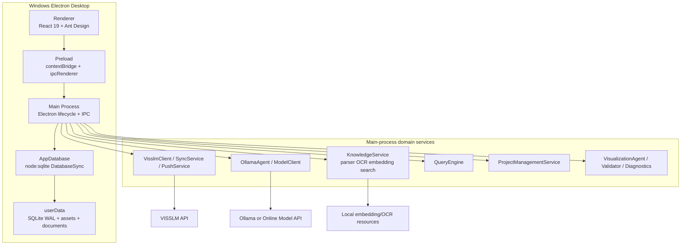
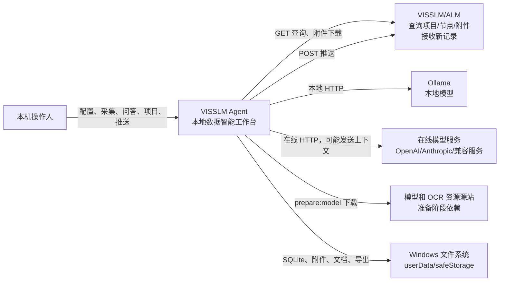
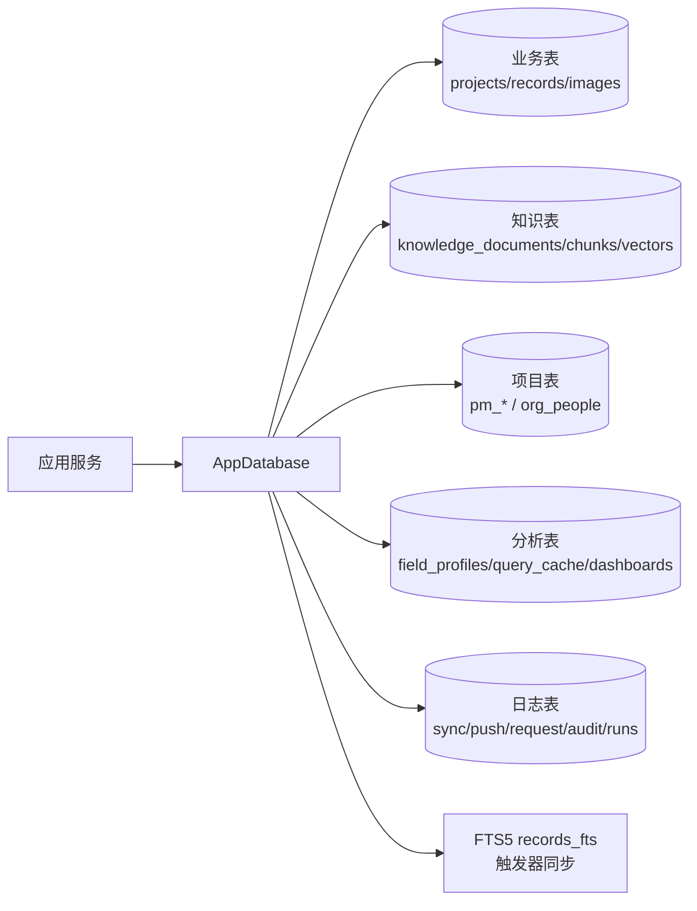
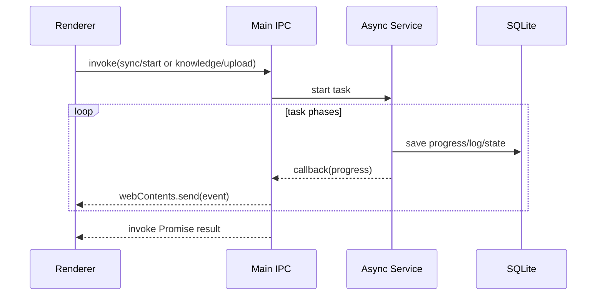
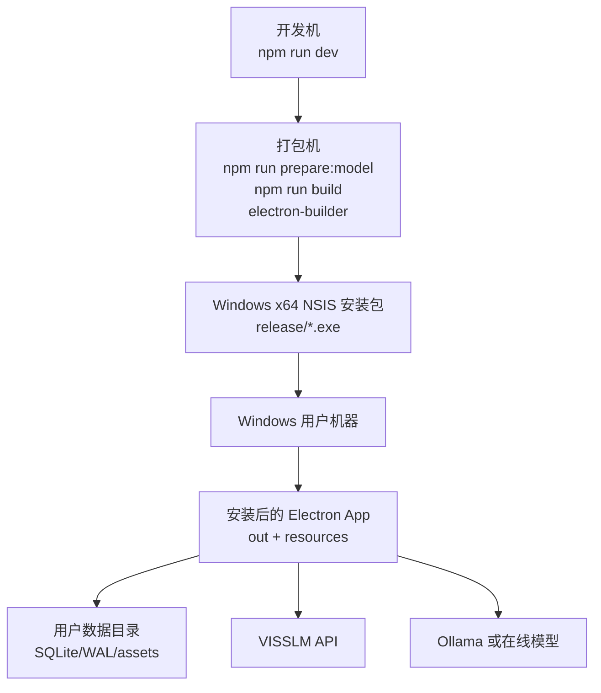
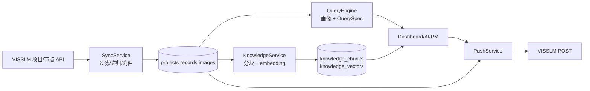

# 03 系统架构设计

> 最后分析时间：2026-08-01  
> 代码基线：Git `9bab57fc5166770784c1855857a6e1a8ebaa6200`；当前工作树含未提交改动。  
> 依据：`docs/00-project-scan.md`、`docs/01-code-mapping.md`、`src/main/index.ts`、`src/main/database.ts`、`src/preload/index.ts`、`src/renderer/src/main.tsx`。

## 1. 总体架构

项目采用单进程桌面应用架构：Electron 主进程既负责窗口和 IPC，也承载本地领域服务；renderer 只通过 preload 白名单 API 访问业务能力；SQLite 和 `userData` 文件目录是本地持久化边界。



没有独立 API Gateway、应用服务器或服务发现层。所有本地业务请求在一个 Electron 主进程中执行，长任务通过 Promise、回调和 renderer 事件返回进度。

## 2. 系统上下文图



外部模型和资源源站的可用性不由应用控制；运行时 embedding/OCR 设计为读取本地资源，资源准备和打包阶段才需要访问源站。

## 3. 前端架构

### 3.1 入口与页面骨架

`src/renderer/src/main.tsx` 做三件事：挂载 React、配置中文 locale、加载暗色 Ant Design theme。`App.tsx` 提供 AppShell、窗口标题栏、侧栏导航、页面标题区和页面组件分发。

页面实现以大文件页面组件为主，而不是独立路由/容器层：

- `App.tsx` 同时包含数据概览、资产中心、知识库、聊天、同步、推送、设置、窗口组件；
- `dashboard/DashboardStudio.tsx` 管理大屏工作区状态、查询、草稿和版本；
- `project-management/ProjectManagementPage.tsx` 管理项目列表及详情子面板；
- `ResizableTable.tsx` 提供多数表格的通用列宽能力；项目匹配/组织人员/计划等部分仍自定义 header resize。

### 3.2 状态管理

主要使用 React `useState/useEffect/useMemo/useCallback`，没有 Redux、MobX 或其他全局状态库。跨页面的关键状态在 `AppShell` 提升：

- `settings`、当前页面、`refreshKey`；
- 当前聊天消息和生成的 Dashboard artifact；
- 数据范围和模型连通状态；
- sync progress。

可视化草稿部分使用 `localStorage`，列宽也使用 `localStorage`。数据库是业务数据的持久化源；renderer 的 localStorage 不是业务事实源。

### 3.3 安全边界

创建窗口时配置 `sandbox:true`、`contextIsolation:true`、`nodeIntegration:false`，preload 只暴露 `AppApi`。renderer 不直接读取数据库、文件系统或 Node API；文件选择、写文件、HTTP、模型和 SQLite 由主进程完成。

## 4. 后端/主进程架构

### 4.1 生命周期

`app.requestSingleInstanceLock()` 确保单实例；`app.whenReady()` 初始化数据库和服务，注册 IPC 后创建窗口；`before-quit` 调用 `db.close()`。服务装配顺序为：

```text
AppDatabase
  -> SettingsService
  -> KnowledgeService
  -> ProjectManagementService(db, knowledge, model settings, progress)
  -> SyncService(db, VisslmClient factory, progress)
  -> PushService(db, VisslmClient factory)
  -> registerIpc()
  -> KnowledgeService.initialize()
  -> createWindow()
```

代码依据：`src/main/index.ts:860-900`。

### 4.2 分层实际形态

| 层 | 实际实现 | 说明 |
|---|---|---|
| 接入层 | `ipcMain.handle` | 用字符串通道代替 HTTP 路由 |
| 应用服务层 | `SyncService`、`PushService`、`KnowledgeService`、`ProjectManagementService`、`OllamaAgent`、`QueryEngine` | 包含业务编排和部分校验 |
| 基础设施适配 | `VisslmClient`、`ModelClient`、`DocumentParser`、`EmbeddingService` | 外部 HTTP、本地文件、模型和解析器 |
| 数据访问 | `AppDatabase` | 没有独立 repository/DAO；SQL 和映射集中在一个类 |
| 事件输出 | `webContents.send` | `sync:progress`、`knowledge:progress`、`project:progress`、`agent:event` |

## 5. 数据访问架构

`AppDatabase` 构造时启用 WAL、外键和 busy timeout，随后执行幂等迁移 SQL。SQLite 表同时承载业务数据、设置、向量、缓存和日志。



数据库访问特点：

- 参数化 SQL 用于多数读写；导入/删除/项目快照包含显式事务；
- 外键在数据库层启用，项目、记录、知识 chunks/vectors 等使用 CASCADE/RESTRICT/SET NULL；
- `records_fts` 为 content table FTS5，由 insert/update/delete trigger 维护；
- 配置以 key/value 字符串保存，复杂配置 JSON 序列化；
- 向量以 BLOB + dimension + model_version 保存，同时持久化 8 步长低维粗向量和 4 位分片提示；应用侧仍计算 cosine，不使用 SQLite 向量扩展。

## 6. 缓存设计

| 缓存 | 存储 | key/失效方式 | 风险 |
|---|---|---|---|
| 字段画像 | SQLite `field_profiles` | `scope hash + data_revision`；数据 revision 变更时失效 | scope 规范化和 revision 一致性依赖代码 |
| QuerySpec 结果 | SQLite `query_cache` | `query hash + data_revision`，有 expires_at | 当前文档未确认定时清理机制；需关注过期行积累 |
| 记录全文索引 | SQLite FTS5 `records_fts` | 触发器同步 | 迁移/批量导入失败时需重建验证 |
| 知识向量 | SQLite `knowledge_vectors` | model_version；模型变化需重建；粗向量旧数据按批回填 | 大量向量占用单文件 SQLite；大索引查询先做粗向量候选预筛 |
| 知识搜索结果 | KnowledgeService 内存有界缓存 | `modelVersion + 规范化问题 + limit`；15 秒 TTL，向量写入时清空，最多 64 项 | 仅合并短时间完全相同的问题，不能替代 ANN；写入尚未完成时可能短暂返回旧结果 |
| 导入运行状态 | SQLite `data_import_runs` | `importRunId`；批次更新、启动失败归档、终态 30 天清理 | 只记录诊断与恢复线索，不把多个批次合并成全局事务 |
| UI 草稿 | renderer localStorage | Dashboard id/版本 key | 不属于数据库备份，跨设备不迁移 |
| 表格列宽 | renderer localStorage | `v1` + table key 或页面作用域 key | 自定义表格和统一表格实现不完全一致 |

未发现 Redis、内存 LRU、浏览器 Cache API 或第三方缓存服务。

## 7. 文件和存储设计

运行时主要目录：

```text
<userData>/
├─ visslm-agent.db            # SQLite 主库
├─ visslm-agent.db-wal/shm    # SQLite WAL 辅助文件
└─ assets/
   ├─ base64/                 # 记录附件按 sha256 保存
   └─ documents/              # 知识文档按 sha256 + 扩展名保存（当前工作树实现）
```

`knowledge_documents.file_path` 保留源文件管理路径；PDF/DOCX 预览由主进程签发短期 `visslm-preview://` 地址并以流响应，兼容字段不再承担大文件传输。导出文件由用户在 Electron 对话框中选择路径，不自动上传。

数据库备份要求：退出应用后同时备份数据库及 assets 目录；源文件如果不在 managed documents 目录或项目快照中，路径失效会影响重新解析。该限制在 `README.md:234-245` 已明确。

## 8. 认证与授权

### 8.1 外部认证

- VISSLM REST 接口使用用户名 + API Token；字段定义读取、用户显示名查询的部分部署兼容路径以及富文本图片上传使用平台网页登录密码，通过 `/User/LogOn` + `/User/UPLogOn` 建立 `JSESSIONID`。字段定义以只读表单 POST 调用 `/Admin/Virtualization_ReadMember`，只在明确的 HTTP/ErrorCode 999 或登录页时重新登录并重放一次；富文本图片上传还携带配对的 `ckCsrfToken`；
- 相同登录名的显示名请求在客户端内去重并缓存；合法 JSON 未返回显示名时缓存为空。HTTP 500、损坏 JSON 或普通 HTML 不触发用户显示名查询的会话兜底；配置了用户属性解析时，缺少/错误密码或会话建立失败会使采集失败。字段定义读取则记录脱敏进度、保留最近成功目录并继续采集。API Token 与平台登录密码均由操作系统安全存储加密，界面只返回是否已配置，不回显秘密值；
- Ollama 本地服务不需要 API Key；
- 在线模型使用 Bearer 或 Anthropic `x-api-key` 头；
- Token、平台登录密码和 API Key 在 settings 表保存为 safeStorage 密文，应用仅返回 `hasToken/hasUploadPassword/hasApiKey`。

### 8.2 应用授权

应用级认证和授权不在本项目范围内。IPC handler 接收来自 renderer 的参数后直接执行，无用户身份、角色、组织或资源 ACL；功能开关只控制菜单。这是已确认的单机单用户架构边界，不应在普通功能开发中自行引入 RBAC。

## 9. 日志与审计

| 日志 | 内容 | 表/输出 |
|---|---|---|
| 主进程错误 | renderer load、console warning/error、知识库初始化失败 | `console.error` |
| 采集请求 | 请求参数、HTTP 状态、记录数、响应/错误、耗时区间 | `collection_request_logs` |
| 同步运行 | 批次汇总和错误 | `sync_runs` |
| 推送请求 | 每条请求、响应、HTTP 状态、remote UID、错误 | `push_logs` + records push 状态 |
| 知识索引进度 | 阶段、当前/总数、消息 | `knowledge_index_tasks` + event |
| 项目分析进度 | 阶段、当前/总数、消息、输出预留字段 | `pm_analysis_runs` + event |
| Dashboard 审计 | save/restore/diagnose/repair/export-* 状态、格式、版本、受限 metadata 和 Spec 指纹 | `dashboard_audit_logs`；完整 Spec 仅在 `dashboard_versions` 保存 |
| 可视化运行 | 模型、prompt 版本、尝试次数、查询数、耗时和错误 | `visualization_runs` |

日志中可能包含业务字段或响应内容；Dashboard 审计的 `specHash`/`sourceSpecHash` 仅为稳定指纹，不是完整数据快照；没有发现按操作者、租户或保留期清理的审计机制。

## 10. 定时任务、消息和异步处理

### 10.1 定时任务

未发现 cron、Electron `setInterval`、系统任务计划或外部调度器。所有操作由用户操作、应用初始化或 API 调用触发。

### 10.2 消息处理

未发现 MQ、WebSocket 业务消息或事件总线。进度使用 Electron IPC 推送：



主进程退出会中止进程内任务；项目分析在下一次初始化时把遗留 processing 状态改成 failed，知识库索引任务则标为可重试并把处理中断文档放回 queued 恢复队列。知识库解析、embedding、重建和记录索引支持 cooperative 取消；同步、采集请求和推送日志在下一次打开数据库时会把遗留 active 状态标记为 failed，但同步与推送仍没有跨退出的持久恢复队列。

## 11. 外部系统集成

### 11.1 VISSLM

`VisslmClient` 对平台查询、附件下载、范围预览和 `/alm/rest/items` POST 做封装。响应解析、正文规范化、图片 URL 扫描、过滤器比较、分页递归和请求日志由 `visslm.ts` 完成。查询、下载和预览等幂等 GET 现在对超时、网络失败及 408/425/429/5xx 使用有限次数的指数退避重试；创建记录和图片上传仍不自动重试，因为平台正式接口尚未声明幂等键契约。

`system.userPropertyKeys` 会在采集查询中强制并入 `ReturnProperty`。同步解析每个非空用户属性时，先使用 API Token 查询 `/ssf/user/getUserByName`，必要时按 8.1 的网页登录会话规则重试；成功得到的显示名可在重新采集时回填 `${key}_text`，对象属性回填对象内的 `key_text`。

每个配置节点类型在读取记录前使用同一网页登录会话调用 `/Admin/Virtualization_ReadMember`，固定 `proId=0`。响应中的公共字段以请求节点类型为作用域落入 `field_definitions`；显示名进入记录规范化文本和字段展示，平台声明类型与采集值观察类型分别进入 AI/分析字段目录。目录请求失败时继续使用最近一次成功缓存，不能用空响应覆盖本地定义。

### 11.2 模型服务

`ModelClient` 根据 `ModelSettings` 分发：

- 本地：Ollama `/api/tags`、`/api/chat`；
- 在线 OpenAI-compatible：`/models`、`/chat/completions`；
- Anthropic：`/messages`，转换 system、tool、thinking 内容。

模型接口调用超时大多为 180 秒；模型服务错误转换为带服务商和 HTTP 状态的 Error。在线上下文外发没有统一的字段过滤层。

### 11.3 本地 AI 资源

`EmbeddingService` 从本地路径加载 Transformer；`DocumentParser` 对 PDF 调用 pdfjs，必要时 tesseract。`prepare:model` 下载模型/OCR资源并生成 manifest，打包通过 electron-builder `extraResources` 注入。

## 12. 部署拓扑



`package.json` 配置 `asar:true`，将 main/preload/renderer 和 package.json 打入；模型和 OCR 通过 `extraResources` 放到安装包资源目录；`@napi-rs/canvas`、onnxruntime-node、sharp 使用 asarUnpack。当前 Windows 包未配置代码签名证书。

## 13. 核心数据流图



项目协议流是在上述数据流旁边的另一条分支：协议文件 -> KnowledgeService -> `ProjectManagementService.extractAgreement` -> 审核集/需求 -> 向量匹配 -> `pm_requirement_matches`。

## 14. 性能设计

当前实现中的性能控制：

- 数据列表分页；多数表格设置响应式 `scroll.y`；
- records 搜索使用 FTS5；
- 字段画像和 QuerySpec 结果按数据 revision 缓存；同一 revision/scope 的短期记录快照复用原始 JSON 解析结果；
- 记录写入复用预编译 SQLite statement，并按 256 条批量事务提交；Dashboard 统计使用 revision + 短 TTL 缓存，发布版本分布优先由 SQLite JSON1 聚合，避免每次刷新在主进程物化全量 `raw_json`；
- VISSLM 同步按 `_valm_ItemID` 匹配已有记录，自动合并并写入本次返回的最新属性值；本地 UID、项目资产和需求关联保持稳定，字段未出现在本次 `ReturnProperty` 响应时保留原值；
- 知识库向量候选缓存 30 秒并缓存向量范数；候选超过 4096 条时先用低维粗向量预筛最多 2048 条，固定容量小顶堆只保留 shortlist，再做精确 cosine，避免每次查询都对全量向量完整排序；
- 完全相同的问题在 15 秒内复用有界搜索结果，向量写入/删除/重建会立即清空结果缓存，避免短时间重复 embedding 和精排；
- 知识库 embedding/index 初始化延迟到首屏窗口可见后，VISSLM 显示值解析和富文本资产遍历限制并发为 8；
- 知识库解析、embedding、重建和记录索引任务通过可取消的 cooperative checkpoint 边界运行，最多同时保留 2 个重任务，退出前统一请求取消；启动时把遗留任务标为可重试并自动恢复排队文档，终态进度保留 30 天；
- 知识库进度事件附带任务耗时和单位吞吐，renderer 在进度条旁展示诊断信息；耗时/吞吐同时持久化到索引任务快照，重启后仍可查看最近一次指标，且不改变既有 IPC 必填字段；
- 旧 JSON/JSONL 导入采用 256 条受控批处理；JSON 数组也按元素流式切分，`data_import_runs` 持久化批次/源行/解析错误/审查批次和耗时线索，重复审查批次 ID 在各批次间复用；原文件仍在时可从最后一个已提交检查点继续，解析器会重放前缀但不会再次提交已完成源行；
- 大屏编辑器、项目管理和 ECharts/Markdown 使用独立 renderer chunks；PNG 导出依赖按需加载；项目进度事件合并/节流，避免高频 IPC 重建页面；
- ECharts 改用按需注册的轻量 React 桥，只打包 bar/line/pie/gauge/funnel/radar/scatter/graph 及所需组件；最近一次生产构建的 ECharts vendor chunk 约 1.62 MB，离线 viewer 约 1.49 MB；
- PDF/DOCX 预览通过带 TTL 的 `visslm-preview://` 流协议读取，资源导入/导出使用二进制资源包；
- embedding 批量大小 32；知识文件上限 100 MB；PDF 预览上限 50 MB；导入上限 512 MB；
- QuerySpec 单次输出最多 500 行，分析扫描默认最多 100000 行；
- 模型请求超时 180 秒，本地健康检查 10 秒，平台下载/请求按客户端实现设置超时；
- 大屏组件有质量诊断和耗时记录。

当前性能风险：大规模向量仍需从 SQLite 枚举候选并计算粗筛分数，短时重复问题虽有有界结果缓存，但粗桶目前只是持久化的分片准备信息，预筛仍是近似策略而非 ANN 索引；embedding、OCR、模型和 SQLite 仍在 Electron 主进程中，任务取消依赖 cooperative checkpoint，无法中断已经进入原生调用的单次模型/OCR 调用。后台 worker、专用 ANN 索引和真正按 shard 的分页检索尚未引入。

## 15. 可扩展性设计

相对清晰的扩展点：

- `ModelClient` provider 分支，可增加在线模型适配；
- `DashboardComponentType`/`componentRegistry`/renderer，可增加组件；
- `QuerySpec` 聚合/计算/过滤协议，可增加分析能力；
- `KnowledgeService` parser、embedding、chunker 可替换；
- `ProjectManagementService` 的提取和匹配阶段可替换模型策略；
- `AppApi`/IPC 通道可增加桌面能力。

主要扩展阻力：`AppDatabase` 单类集中大量 SQL 和映射；`App.tsx` 和 `ProjectManagementPage.tsx` 组件过大；类型、UI、IPC 字符串和 SQL 没有代码生成；任务没有持久队列。模块权限边界按已确认的单机单用户范围不建设。

## 16. 当前架构风险

1. 单主进程承载 SQLite、网络、embedding、OCR、模型和项目长任务，容易在大文件/大数据时阻塞或占用内存。
2. `AppDatabase` 同时作为 migration、DAO、领域查询和数据映射层，跨模块耦合高。
3. 不提供 RBAC/登录；这是已确认的单机单用户边界。功能开关不是权限，且本机操作审计主体仍不区分用户。
4. 外部协议的 GET 错误重试已有固定上限和退避，但限流、POST 幂等和断点续传仍未形成可配置架构。
5. 在线模型数据外发控制在调用方选项，缺少统一隐私策略和可审计审批。
6. SQLite 文件和本地向量数量增长后，备份、迁移、并发和恢复能力有限。
7. 长任务只在部分项目状态有重启恢复；没有全局任务管理/取消/重试/队列。
8. UI 表格列宽能力存在多个实现，容易出现标准漂移。
9. 部署资源下载与产品版本耦合；无代码签名和自动发布渠道。
10. API 契约只有 TypeScript 类型，没有运行时 schema 校验的统一入口，IPC 参数可由 renderer 直接传入。

## 17. 代码依据索引

核心依据：`src/main/index.ts`（生命周期/IPC/安全窗口/导出）、`src/preload/index.ts`（隔离边界）、`src/main/database.ts`（SQLite/迁移/缓存/表）、`src/main/visslm.ts`（外部集成）、`src/main/knowledge.ts`（知识处理）、`src/main/ollama.ts` 和 `src/main/model-client.ts`（AI）、`src/main/project-management.ts`（项目工作流）、`src/main/analytics/query-engine.ts`（查询）、`src/main/experts/*` 与 `src/main/dashboards/*`（可视化）、`src/renderer/src/main.tsx`、`src/renderer/src/App.tsx`、`package.json`、`electron.vite.config.ts`、`README.md`。
# AI 助手证据与受控交付层（2026-08）

`Assistant Orchestrator → 专业 Agent → EvidenceBlock → Artifact Preview → 用户确认 → Artifact Version/Export`

字段语义由 `QueryEngine` 持久化并合并进入 `DataCenterAgent` 字段目录。`EvidenceBlock` 在主进程响应边界统一构造。交付物预览由主进程规范化并签名，提交时重新校验哈希；导出器只读取已确认且未撤销的本地交付物。`assistant_run_history` 独立保存运行质量指标，不从回答文本反推状态。
