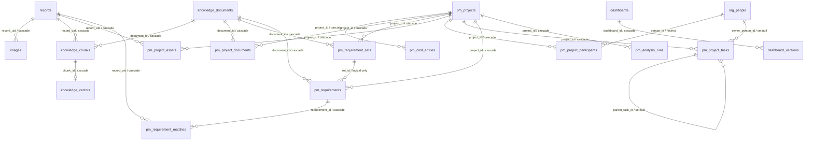

# 05 数据库设计

> 最后分析时间：2026-08-01（Asia/Singapore）  
> 代码基线：Git `9bab57fc5166770784c1855857a6e1a8ebaa6200`；当前工作树存在未提交修改，本文件以当前工作树中的 `src/main/database.ts` 为准。  
> 关联文档：[00 项目扫描](./00-project-scan.md)、[01 代码映射](./01-code-mapping.md)、[03 系统架构](./03-system-architecture.md)、[04 模块设计](./04-module-design.md)、[06 API 设计](./06-api-design.md)

## 1. 数据库概况

应用不连接独立数据库服务器，也没有独立建表 SQL 目录。SQLite schema 在 `AppDatabase.migrate()` 内通过 `node:sqlite` 的 `DatabaseSync` 创建，数据库文件位于 Electron `app.getPath('userData')` 下的 `visslm-agent.db`。

代码依据：`src/main/database.ts:1-4,452-462`、`src/main/index.ts:860-864`。

| 项目 | 当前实现 |
| --- | --- |
| 数据库类型 | SQLite，通过 Node.js `node:sqlite` `DatabaseSync` 访问 |
| 连接模式 | 单个主进程实例持有一个连接；renderer 不直接访问 SQLite |
| 事务/并发 | `PRAGMA journal_mode=WAL`、`foreign_keys=ON`、`busy_timeout=5000`；部分批量写入显式使用 `BEGIN IMMEDIATE` |
| 全文检索 | `records_fts` FTS5 content table，优先 `trigram` tokenizer，失败时回退默认 tokenizer |
| 文件资产 | 图片二进制资源在 `<userData>\assets\blobs\<sha 前 2 位>\<sha256>`；旧 Base64 目录仅用于迁移兼容；知识库文件仍在 `<userData>\assets\documents` |
| 迁移 | 每次启动执行 `CREATE TABLE/INDEX IF NOT EXISTS`，随后逐条尝试 `ALTER TABLE`；没有独立 schema version 表 |
| 时间格式 | 业务写入统一使用 `new Date().toISOString()`，字段类型为 SQLite `TEXT` |
| JSON 字段 | 多个复杂对象、数组和原始平台响应以 JSON 字符串保存，读取时由 `database.ts` 映射和解析 |

## 2. 表和虚表清单

| 编号 | 对象 | 类型 | 用途 | 主要读写入口 |
| --- | --- | --- | --- | --- |
| DB-01 | `settings` | 表 | 平台、模型、功能开关、导航顺序、同步范围和分析 revision | `getSetting/setSetting`；`SettingsService` |
| DB-02 | `chat_sessions` | 表 | AI 会话摘要和消息 JSON | `listChatSessions/getChatSession/saveChatSession/deleteChatSession` |
| DB-03 | `projects` | 表 | VISSLM 外部项目缓存 | `upsertProject/listProjects`；同步和导入 |
| DB-04 | `records` | 表 | VISSLM 节点/业务记录、原始 JSON、规范化全文和推送状态 | `upsertRecord/listRecords/getRecord`；采集、导入、删除、推送 |
| DB-05 | `images` | 表 | 记录附件或正文图片的 hash、元数据和文件路径 | `saveImage/getRecord/exportRows/deleteData` |
| DB-31 | `asset_blobs` | 表 | 全局内容寻址的图片二进制、MIME、字节数和路径 | `saveAssetBlob/getAssetBlob/readAssetBytes` |
| DB-32 | `record_image_refs` | 表 | 富文本字段中的图片令牌、出现顺序、来源和资源 hash | `saveRecordImageReference/listRecordImageReferences` |
| DB-33 | `push_asset_uploads` | 表 | 目标地址/项目/SHA-256 到远程上传路径的复用缓存 | `getPushAssetUpload/savePushAssetUpload` |
| DB-06 | `sync_runs` | 表 | 同步运行摘要 | `beginSync/finishSync/listSyncRuns` |
| DB-34 | `data_import_runs` | 表 | JSON/JSONL 流式导入的批次、解析错误、耗时、源文件指纹和中断状态 | `start/update/finish/resume/reconcileDataImportRun` |
| DB-07 | `push_logs` | 表 | 每条推送请求、脱敏参数、body、响应和结果 | `beginPushLog/finishPushLog/listPushLogs` |
| DB-08 | `collection_request_logs` | 表 | 采集阶段每个 GET 请求的脱敏追踪信息 | `beginCollectionRequestLog/finishCollectionRequestLog/listCollectionRequestLogs` |
| DB-09 | `dashboards` | 表 | Dashboard 当前版本和摘要 | `listDashboards/getDashboard/saveDashboard` |
| DB-10 | `dashboard_versions` | 表 | 每次保存的大屏完整 `DashboardSpec` JSON | `getDashboard/listDashboardVersions/saveDashboard/restoreDashboard` |
| DB-11 | `visualization_runs` | 表 | 可视化专家生成/失败运行记录 | `recordVisualizationRun/listVisualizationRuns` |
| DB-12 | `dashboard_audit_logs` | 表 | 大屏保存、恢复、诊断、导出审计 | `recordDashboardAuditLog/listDashboardAuditLogs` |
| DB-13 | `field_profiles` | 表 | 数据范围下的字段画像和人工语义 | `getFieldProfiles/saveFieldProfiles/updateFieldProfileSemantics` |
| DB-14 | `query_cache` | 表 | QuerySpec 结果的 revision/TTL 缓存 | `getQueryCache/saveQueryCache` |
| DB-15 | `knowledge_documents` | 表 | 上传文档元数据、hash、处理状态和来源路径 | `insert/update/list/get/deleteKnowledgeDocument` |
| DB-16 | `knowledge_chunks` | 表 | 文档或采集记录的文本分块 | `replace/clear/listKnowledge*Chunks` |
| DB-17 | `knowledge_vectors` | 表 | 分块向量二进制数据 | `saveKnowledgeVectors/listKnowledgeVectorRows/deleteKnowledgeVectors` |
| DB-18 | `knowledge_index_tasks` | 表 | 知识索引进度快照 | `saveKnowledgeIndexProgress` |
| DB-19 | `org_people` | 表 | 项目管理中的组织人员 | `list/create/update/deleteOrganizationPerson` |
| DB-20 | `pm_projects` | 表 | 本地项目管理主数据和分析/匹配状态 | `create/update/list/getManagedProject` |
| DB-21 | `pm_cost_entries` | 表 | 项目估算/实际成本明细 | `insert/update/list/deleteProjectCostEntry` |
| DB-22 | `pm_project_documents` | 表 | 项目与知识库文档的版本关联 | `linkProjectDocument/listManagedProjectDocuments` |
| DB-23 | `pm_requirement_sets` | 表 | 技术协议解析产生的审核/发布版本 | `create/get/publishProjectRequirementSet` |
| DB-24 | `pm_project_assets` | 表 | 项目与数据中心记录的关联 | `link/unlink/listProjectAssets` |
| DB-25 | `pm_project_participants` | 表 | 项目参与人员及人力估算 | `insert/update/list/deleteProjectParticipant` |
| DB-26 | `pm_project_tasks` | 表 | 项目计划、层级任务和甘特图数据 | `insert/update/move/list/deleteProjectTask` |
| DB-27 | `pm_requirements` | 表 | 需求条目、审核状态、AI 状态和关键术语 | `create/update/split/merge/review/publish/update status` |
| DB-28 | `pm_requirement_matches` | 表 | 需求与数据中心记录的向量/AI 匹配结果 | `replaceRequirementMatches/listProjectRequirementMatches` |
| DB-29 | `pm_analysis_runs` | 表 | 技术协议解析和匹配任务进度 | `saveProjectAnalysisProgress/reconcileInterruptedProjectAnalysis` |
| DB-30 | `records_fts` | FTS5 虚表 | 为 `records` 的名称、编号、类型和规范化正文提供全文搜索 | `records_ai/records_ad/records_au` 触发器；`searchForAgent/listRecords` |
| DB-31 | `field_definitions` | 表 | 按数据类型保存平台字段显示名、声明类型和字段属性 | `replaceFieldDefinitions/getFieldDefinitions/getFieldDisplayNames` |

## 3. 字段定义

以下字段含义根据建表 SQL、映射函数、写入方法和业务服务共同确定。仅从 schema 无法确认的业务语义标注为“待确认”。

### 3.1 配置、会话和采集数据

#### `settings`

| 字段 | 类型/约束 | 业务含义 |
| --- | --- | --- |
| `key` | `TEXT PRIMARY KEY` | 配置键，例如 `platform.baseUrl`、`model.source`、`sync.scope`、`analytics:data-revision` |
| `value` | `TEXT NOT NULL` | 配置值；布尔值、数字和复杂对象均序列化为文本；平台 Token/API Key 保存为 `safeStorage` 密文 |

#### `chat_sessions`

| 字段 | 类型/约束 | 业务含义 |
| --- | --- | --- |
| `id` | `TEXT PRIMARY KEY` | 会话标识 |
| `title` | `TEXT NOT NULL` | 会话标题 |
| `preview` | `TEXT NOT NULL DEFAULT ''` | 会话列表预览文本 |
| `messages_json` | `TEXT NOT NULL DEFAULT '[]'` | `ChatMessage[]` JSON；读取时会进行结构清洗 |
| `message_count` | `INTEGER NOT NULL DEFAULT 0` | 消息数量缓存 |
| `created_at` | `TEXT NOT NULL` | 创建时间 |
| `updated_at` | `TEXT NOT NULL` | 最近保存时间；有 `idx_chat_sessions_updated` |

#### `projects`

| 字段 | 类型/约束 | 业务含义 |
| --- | --- | --- |
| `uid` | `TEXT PRIMARY KEY` | VISSLM 项目 UID |
| `name` | `TEXT NOT NULL` | 项目显示名称 |
| `item_id` | `TEXT NOT NULL DEFAULT ''` | 外部业务编号 |
| `last_modify_time` | `TEXT NOT NULL DEFAULT ''` | 平台最后修改时间 |
| `raw_json` | `TEXT NOT NULL DEFAULT '{}'` | 项目原始 JSON |
| `synced_at` | `TEXT NOT NULL` | 本地同步时间 |

#### `records`

| 字段 | 类型/约束 | 业务含义 |
| --- | --- | --- |
| `uid` | `TEXT PRIMARY KEY` | 外部节点唯一 UID |
| `project_id` | `TEXT NOT NULL DEFAULT ''` | 所属外部项目 UID；当前没有到 `projects.uid` 的 FK |
| `node_type` | `TEXT NOT NULL DEFAULT ''` | VISSLM 节点类型 |
| `item_id` | `TEXT NOT NULL DEFAULT ''` | 外部业务编号 |
| `parent_id` | `TEXT NOT NULL DEFAULT ''` | 外部父节点 UID |
| `name` | `TEXT NOT NULL DEFAULT ''` | 显示名称，缺失时由 UID 补充 |
| `last_modify_time` | `TEXT NOT NULL DEFAULT ''` | 外部最后修改时间 |
| `raw_json` | `TEXT NOT NULL` | 原始平台属性，问答、推送和导出均依赖此字段 |
| `normalized_text` | `TEXT NOT NULL DEFAULT ''` | 从原始 JSON 递归抽取并去 HTML 的可检索文本 |
| `content_hash` | `TEXT NOT NULL` | 规范化内容 hash，用于知识库增量索引 |
| `synced_at` | `TEXT NOT NULL` | 本地写入时间 |
| `push_status` | `TEXT NOT NULL DEFAULT 'pending'` | `pending`、`success`、`failed` |
| `push_message` | `TEXT NOT NULL DEFAULT ''` | 最近一次推送结果或错误 |
| `pushed_at` | `TEXT NOT NULL DEFAULT ''` | 最近一次推送完成时间 |
| `pushed_uid` | `TEXT NOT NULL DEFAULT ''` | 平台返回的新记录 UID |

索引：`project_id`、`node_type`、`parent_id`、`last_modify_time`、`push_status`。`records` 由 FTS 触发器保持 `records_fts` 同步。

#### `images`

| 字段 | 类型/约束 | 业务含义 |
| --- | --- | --- |
| `id` | `TEXT PRIMARY KEY` | 图片资产 ID |
| `record_uid` | `TEXT NOT NULL` + FK `records(uid) ON DELETE CASCADE` | 所属记录 |
| `name` | `TEXT NOT NULL DEFAULT ''` | 图片名称或来源字段名称 |
| `mime_type` | `TEXT NOT NULL DEFAULT 'application/octet-stream'` | MIME 类型 |
| `source_url` | `TEXT NOT NULL DEFAULT ''` | 原始 URL；内嵌图片写为不含 Base64 的 `inline:data-uri:<sha256>` 标记 |
| `sha256` | `TEXT NOT NULL` | 图片内容 hash |
| `base64_path` | `TEXT NOT NULL` | 旧版本 Base64 文件路径，仅用于启动迁移，迁移后为空 |
| `binary_path` | `TEXT NOT NULL DEFAULT ''` | 当前内容寻址二进制路径；真实文件位于 `asset_blobs.binary_path` |
| `byte_size` | `INTEGER NOT NULL DEFAULT 0` | 原始字节数 |
| `state` | `TEXT NOT NULL DEFAULT 'ready'` | `ready`、`unresolved` 或迁移后缺失资源的状态 |
| `error_message` | `TEXT NOT NULL DEFAULT ''` | 图片下载、校验或 MIME 失败原因 |
| `created_at` | `TEXT NOT NULL` | 保存时间 |

唯一约束：`UNIQUE(record_uid, sha256)`。同一记录不会重复保存同一 hash 的图片；跨记录可以复用相同内容但会有不同记录关联行。

#### `sync_runs`

| 字段 | 类型/约束 | 业务含义 |
| --- | --- | --- |
| `id` | `INTEGER PRIMARY KEY AUTOINCREMENT` | 同步运行 ID |
| `started_at` / `finished_at` | `TEXT NOT NULL` | 开始/结束时间；运行中结束时间为空 |
| `status` | `TEXT NOT NULL` | 实际写入 `running`、`success`、`failed` |
| `project_count` | `INTEGER NOT NULL DEFAULT 0` | 本次识别的 Project 数 |
| `record_count` | `INTEGER NOT NULL DEFAULT 0` | 本次成功写入/保留的记录数 |
| `image_count` | `INTEGER NOT NULL DEFAULT 0` | 本次保存图片数 |
| `error_message` | `TEXT NOT NULL DEFAULT ''` | 失败原因 |

应用启动打开数据库时会把遗留的 `running` 同步、采集请求和 `sending` 推送日志统一标记为 `failed` 并写入中断原因；这只修复可观测状态，不会自动重放外部 POST。

#### `data_import_runs`

| 字段 | 类型/约束 | 业务含义 |
| --- | --- | --- |
| `id` | `TEXT PRIMARY KEY` | 本次 JSON/JSONL 流式导入诊断 ID，返回在 `DataImportResult.importRunId` |
| `path` / `format` | `TEXT NOT NULL` | 导入文件路径和 `json`/`jsonl` 格式 |
| `file_size` / `file_mtime_ms` | `INTEGER NOT NULL DEFAULT 0` | 启动时记录的文件大小和修改时间，用于继续导入前验证源文件未被替换 |
| `status` | `TEXT NOT NULL` | `running`、`success`、`failed` |
| `batch_count` / `source_row_count` | `INTEGER NOT NULL DEFAULT 0` | 已提交批次数和解析到的源行数 |
| `imported_record_count` / `skipped_count` | `INTEGER NOT NULL DEFAULT 0` | 已写入记录数和跳过数 |
| `parse_error_count` | `INTEGER NOT NULL DEFAULT 0` | 流式解析错误数 |
| `review_batch_id` | `TEXT NOT NULL DEFAULT ''` | 跨批次复用的数据重复审查批次 |
| `error_message` | `TEXT NOT NULL DEFAULT ''` | 中断或失败原因 |
| `started_at` / `updated_at` / `finished_at` | `TEXT NOT NULL` | 运行时间；运行中结束时间为空 |

应用启动时会将遗留 `running` 运行标记为 `failed`，保留已提交批次和诊断指标；确认文件大小/修改时间未变化后，失败运行可以从 `source_row_count`/`parse_error_count` 检查点继续；终态运行记录按 30 天清理。该表不改变批次事务边界，因此仍不承诺全有或全无。

#### `push_logs`

| 字段 | 类型/约束 | 业务含义 |
| --- | --- | --- |
| `id` | `INTEGER PRIMARY KEY AUTOINCREMENT` | 单条推送日志 ID |
| `record_uid` / `record_name` | `TEXT NOT NULL` | 本地记录身份和名称快照 |
| `method` | `TEXT NOT NULL DEFAULT 'POST'` | 当前固定为 `POST` |
| `endpoint` | `TEXT NOT NULL DEFAULT ''` | `/rest/items` 的完整地址；不应依赖此字段恢复凭据 |
| `params_json` | `TEXT NOT NULL DEFAULT '{}'` | 脱敏查询参数 JSON，API Token 应为 `******` |
| `body_json` | `TEXT NOT NULL DEFAULT '{}'` | 实际推送 body；可能包含业务敏感字段 |
| `status` | `TEXT NOT NULL DEFAULT 'sending'` | `sending`、`success`、`failed` |
| `http_status` | `INTEGER NOT NULL DEFAULT 0` | HTTP 状态码，未发出或非 HTTP 错误为 0 |
| `response_json` | `TEXT NOT NULL DEFAULT ''` | 平台返回 JSON/文本 |
| `error_message` | `TEXT NOT NULL DEFAULT ''` | 错误信息 |
| `remote_uid` | `TEXT NOT NULL DEFAULT ''` | 平台返回的 `_valm_Uid` |
| `created_at` / `finished_at` | `TEXT NOT NULL` | 请求开始/完成时间 |

当前没有 `record_uid` 外键，删除本地记录不会清理历史推送日志。

#### `collection_request_logs`

| 字段 | 类型/约束 | 业务含义 |
| --- | --- | --- |
| `id` | `INTEGER PRIMARY KEY AUTOINCREMENT` | 采集请求日志 ID |
| `node_type` | `TEXT NOT NULL DEFAULT ''` | 请求的配置数据类型 |
| `method` | `TEXT NOT NULL DEFAULT 'GET'` | 当前固定为 `GET` |
| `endpoint` | `TEXT NOT NULL DEFAULT ''` | `/rest/items` 地址 |
| `params_json` | `TEXT NOT NULL DEFAULT '{}'` | 查询条件和返回字段；API Token 应脱敏 |
| `status` | `TEXT NOT NULL DEFAULT 'running'` | `running`、`success`、`failed` |
| `http_status` | `INTEGER NOT NULL DEFAULT 0` | 平台 HTTP 状态码 |
| `record_count` | `INTEGER NOT NULL DEFAULT 0` | 本请求返回条数 |
| `response_json` | `TEXT NOT NULL DEFAULT ''` | 当前实现仅保存摘要或平台响应 |
| `error_message` | `TEXT NOT NULL DEFAULT ''` | 失败原因 |
| `created_at` / `finished_at` | `TEXT NOT NULL` | 请求开始/完成时间 |

### 3.2 Dashboard、分析和缓存

#### `dashboards`

| 字段 | 类型/约束 | 业务含义 |
| --- | --- | --- |
| `id` | `TEXT PRIMARY KEY` | DashboardSpec ID |
| `title` / `subtitle` | `TEXT NOT NULL` | 大屏摘要文本 |
| `theme` | `TEXT NOT NULL` | Dashboard theme ID；合法值由 `shared/dashboard.ts`/validator 约束 |
| `current_version` | `INTEGER NOT NULL` | 当前版本号 |
| `component_count` | `INTEGER NOT NULL DEFAULT 0` | 当前组件数量缓存 |
| `created_at` / `updated_at` | `TEXT NOT NULL` | 生命周期时间 |

#### `dashboard_versions`

| 字段 | 类型/约束 | 业务含义 |
| --- | --- | --- |
| `dashboard_id` | `TEXT NOT NULL` + FK `dashboards(id) ON DELETE CASCADE` | 所属 Dashboard |
| `version` | `INTEGER NOT NULL` | 单个 Dashboard 内递增版本号 |
| `spec_json` | `TEXT NOT NULL` | 完整、已校验的 `DashboardSpec` |
| `change_summary` | `TEXT NOT NULL DEFAULT ''` | 保存或恢复说明 |
| `created_at` | `TEXT NOT NULL` | 版本创建时间 |

主键为 `(dashboard_id, version)`。恢复历史版本不是覆盖原版本，而是创建新版本。

#### `visualization_runs`

| 字段 | 类型/约束 | 业务含义 |
| --- | --- | --- |
| `id` | `TEXT PRIMARY KEY` | 可视化专家运行 ID |
| `dashboard_id` | `TEXT NOT NULL DEFAULT ''` | 生成或修改的大屏 ID；当前无 FK |
| `request_summary` | `TEXT NOT NULL DEFAULT ''` | 用户需求摘要，写入前最多 500 字符 |
| `model_name` / `prompt_version` | `TEXT NOT NULL DEFAULT ''` | 使用的模型和专家 prompt 版本 |
| `status` | `TEXT NOT NULL` | `success` 或 `failed` |
| `attempt_count` | `INTEGER NOT NULL DEFAULT 0` | 生成重试次数 |
| `component_count` / `query_count` | `INTEGER NOT NULL DEFAULT 0` | 产物组件数和查询数 |
| `duration_ms` | `REAL NOT NULL DEFAULT 0` | 运行时长 |
| `error_message` | `TEXT NOT NULL DEFAULT ''` | 失败原因，写入前截断 |
| `created_at` | `TEXT NOT NULL` | 运行时间 |

#### `dashboard_audit_logs`

| 字段 | 类型/约束 | 业务含义 |
| --- | --- | --- |
| `id` | `INTEGER PRIMARY KEY AUTOINCREMENT` | 审计行 ID |
| `dashboard_id` | `TEXT NOT NULL DEFAULT ''` | 关联大屏，可为空字符串表示全局数据导出 |
| `action` | `TEXT NOT NULL` | `save`、`restore`、`diagnose`、`export-json`、`export-pdf`、`export-png`、`export-data` |
| `status` | `TEXT NOT NULL` | `success`、`canceled`、`failed` |
| `version` | `INTEGER` | 相关版本，可空 |
| `format` | `TEXT NOT NULL DEFAULT ''` | `json`、`pdf`、`png`、`jsonl` |
| `metadata_json` | `TEXT NOT NULL DEFAULT '{}'` | 组件数、耗时和稳定 `specHash`/`sourceSpecHash` 等受限元数据；不保存完整 Spec |
| `error_message` | `TEXT NOT NULL DEFAULT ''` | 失败信息 |
| `created_at` | `TEXT NOT NULL` | 审计时间 |

#### `field_profiles`

| 字段 | 类型/约束 | 业务含义 |
| --- | --- | --- |
| `scope_key` | `TEXT NOT NULL` | 数据范围的稳定序列化 key |
| `field` | `TEXT NOT NULL` | 原始 JSON 字段或点路径 |
| `inferred_type` | `TEXT NOT NULL` | `string`、`number`、`boolean`、`date`、`enum`、`array`、`object` 等推断类型 |
| `non_null_rate` | `REAL NOT NULL` | 非空覆盖率 |
| `distinct_count` | `INTEGER NOT NULL` | 去重值数量 |
| `samples_json` | `TEXT NOT NULL DEFAULT '[]'` | 样例值数组，最多保留 5 个 |
| `display_name` | `TEXT NOT NULL DEFAULT ''` | 用户设置的显示名 |
| `role` | `TEXT NOT NULL DEFAULT ''` | `dimension`、`measure`、`time`、`identifier` |
| `synonyms_json` | `TEXT NOT NULL DEFAULT '[]'` | 字段别名，最多 12 个 |
| `sensitivity` | `TEXT NOT NULL DEFAULT 'normal'` | `normal`、`internal`、`sensitive` |
| `profiled_at` | `TEXT NOT NULL` | 画像时间 |
| `data_revision` | `INTEGER NOT NULL` | 与 `settings` 中的 `analytics:data-revision` 对应 |

主键为 `(scope_key, field)`；保存新 revision 时会删除同范围旧 revision 的画像。

#### `field_definitions`

| 字段 | 类型/约束 | 业务含义 |
| --- | --- | --- |
| `node_type` | `TEXT NOT NULL` | 字段所属数据类型；接口返回空 `NodeType` 时使用请求的节点类型 |
| `field` | `TEXT NOT NULL` | 记录原始 JSON 属性 Key，对应平台 `HideMember` |
| `display_name` | `TEXT NOT NULL` | 平台字段显示名，对应 `MemberName` |
| `source_type` | `TEXT NOT NULL DEFAULT ''` | 平台原始 `MemberType` |
| `normalized_type` | `TEXT NOT NULL DEFAULT 'unknown'` | 应用声明类型，例如 `string/number/date/datetime/enum/reference` |
| `attr_type` | `TEXT NOT NULL DEFAULT ''` | 平台本地化 `AttrType` 文案 |
| `source_uid` | `TEXT NOT NULL DEFAULT ''` | 字段定义行 `Uid` |
| `internal_member` | `TEXT NOT NULL DEFAULT ''` | 平台内部 `Member` 标识，不作为采集属性 Key |
| `condition_uid` | `TEXT NOT NULL DEFAULT ''` | 平台 `MemberConditionUid` |
| `is_system` | `INTEGER NOT NULL DEFAULT 0` | 平台 `IsSystem` 布尔标志 |
| `is_editable` | `INTEGER NOT NULL DEFAULT 0` | 平台 `IsEdit` 布尔标志 |
| `is_removable` | `INTEGER NOT NULL DEFAULT 0` | 平台 `IsRemove` 能力标志，不表示字段已经删除 |
| `updated_at` | `TEXT NOT NULL` | 最近一次成功刷新时间 |

主键为 `(node_type, field)`。刷新某个节点类型时在事务内替换该类型的完整有效目录；空或无法解析的响应不进入替换流程，因此保留最近一次成功结果。`field_profiles.inferred_type` 继续保存实际采集值观察类型，不能被 `normalized_type` 覆盖。

#### `query_cache`

| 字段 | 类型/约束 | 业务含义 |
| --- | --- | --- |
| `cache_key` | `TEXT PRIMARY KEY` | QuerySpec 稳定序列化后的 hash/key |
| `data_revision` | `INTEGER NOT NULL` | 数据 revision；不匹配时不命中 |
| `result_json` | `TEXT NOT NULL` | `QueryDataset` JSON |
| `created_at` / `expires_at` | `TEXT NOT NULL` | 写入和 TTL 过期时间，默认 TTL 5 分钟 |

### 3.3 知识库和向量索引

#### `knowledge_documents`

| 字段 | 类型/约束 | 业务含义 |
| --- | --- | --- |
| `id` | `TEXT PRIMARY KEY` | 本地文档 ID |
| `file_name` / `file_path` | `TEXT NOT NULL` | 原文件名和本地受管路径 |
| `extension` | `TEXT NOT NULL` | `.docx`、`.pdf`、`.xlsx`、`.xls`、`.txt` |
| `mime_type` | `TEXT NOT NULL` | 文档 MIME |
| `byte_size` | `INTEGER NOT NULL DEFAULT 0` | 文件大小；上传限制 100 MB |
| `sha256` | `TEXT NOT NULL UNIQUE` | 内容 hash，作为重复文档判定依据 |
| `tags_json` | `TEXT NOT NULL DEFAULT '[]'` | 标签数组，服务层最多 20 个 |
| `status` | `TEXT NOT NULL DEFAULT 'queued'` | `queued`、`processing`、`ready`、`failed` |
| `error_message` | `TEXT NOT NULL DEFAULT ''` | 解析/embedding 失败原因 |
| `chunk_count` / `page_count` | `INTEGER NOT NULL DEFAULT 0` | 分块数和页/工作表数 |
| `model_version` | `TEXT NOT NULL DEFAULT ''` | 生成向量所用模型版本 |
| `created_at` / `updated_at` / `processed_at` | `TEXT NOT NULL` | 文档生命周期时间；未处理时 `processed_at` 为空 |

#### `knowledge_chunks`

| 字段 | 类型/约束 | 业务含义 |
| --- | --- | --- |
| `id` | `TEXT PRIMARY KEY` | 文本分块 ID |
| `document_id` | `TEXT` + FK `knowledge_documents(id) ON DELETE CASCADE` | 上传文档来源；文档记录和采集记录二选一 |
| `record_uid` | `TEXT` + FK `records(uid) ON DELETE CASCADE` | 采集记录来源；与 `document_id` 二选一 |
| `source_type` | `TEXT NOT NULL` | `document` 或 `record` |
| `source_name` / `source_hash` | `TEXT NOT NULL` | 来源名称和内容 hash |
| `content` | `TEXT NOT NULL` | 分块正文 |
| `chunk_index` | `INTEGER NOT NULL` | 来源内部序号 |
| `page_number` | `INTEGER` | PDF 页码，可空 |
| `sheet_name` | `TEXT NOT NULL DEFAULT ''` | Excel 工作表，可空 |
| `location` | `TEXT NOT NULL DEFAULT ''` | 页、工作表或“采集记录”位置 |
| `char_start` / `char_end` | `INTEGER NOT NULL DEFAULT 0` | 原文字符区间 |
| `created_at` | `TEXT NOT NULL` | 分块创建时间 |

唯一约束：`UNIQUE(document_id, chunk_index)` 和 `UNIQUE(record_uid, chunk_index)`。两列可空是为了允许两种来源，但数据完整性依赖服务层。

#### `knowledge_vectors`

| 字段 | 类型/约束 | 业务含义 |
| --- | --- | --- |
| `chunk_id` | `TEXT PRIMARY KEY` + FK `knowledge_chunks(id) ON DELETE CASCADE` | 向量对应的分块 |
| `vector_blob` | `BLOB NOT NULL` | `Float32Array` 二进制 |
| `dimension` | `INTEGER NOT NULL` | 向量维度 |
| `model_version` | `TEXT NOT NULL` | 向量模型版本 |
| `coarse_vector_blob` | `BLOB` | 8 步长抽样并归一化的低维粗向量；旧数据按 512 条/批渐进回填 |
| `coarse_dimension` | `INTEGER NOT NULL DEFAULT 0` | 粗向量维度 |
| `coarse_bucket` | `INTEGER NOT NULL DEFAULT -1` | 4 位符号桶，供后续分片/ANN 适配使用；当前精排仍由服务层完成 |
| `created_at` | `TEXT NOT NULL` | 向量生成时间 |

#### `knowledge_index_tasks`

| 字段 | 类型/约束 | 业务含义 |
| --- | --- | --- |
| `id` | `TEXT PRIMARY KEY` | 索引任务 ID |
| `phase` | `TEXT NOT NULL` | `queued`、`parsing`、`embedding`、`records`、`done`、`error` |
| `status` | `TEXT NOT NULL` | `running`、`success`、`failed` |
| `current_count` / `total_count` | `INTEGER NOT NULL DEFAULT 0` | 当前进度 |
| `elapsed_ms` | `INTEGER NOT NULL DEFAULT 0` | 任务耗时（毫秒），用于重启后恢复诊断 |
| `throughput_per_second` | `REAL NOT NULL DEFAULT 0` | 最近一次进度快照的单位吞吐 |
| `message` | `TEXT NOT NULL DEFAULT ''` | 可读进度信息 |
| `created_at` / `updated_at` | `TEXT NOT NULL` | 任务时间 |

启动时会把遗留的 `running` 知识索引任务标为可重试的 `failed`，把 `processing` 文档放回 `queued` 恢复队列，并清理超过 30 天的终态进度记录。文档分块替换和记录增量索引均保持幂等，恢复不依赖继续使用原任务 ID。

### 3.4 项目管理

#### `org_people`

| 字段 | 类型/约束 | 业务含义 |
| --- | --- | --- |
| `id` | `TEXT PRIMARY KEY` | 人员 ID |
| `name` | `TEXT NOT NULL` | 姓名，服务层要求非空 |
| `employee_no` | `TEXT NOT NULL DEFAULT ''` | 工号 |
| `department` / `role` | `TEXT NOT NULL DEFAULT ''` | 部门和岗位 |
| `hourly_rate` | `REAL NOT NULL DEFAULT 0` | 小时成本 |
| `status` | `TEXT NOT NULL DEFAULT 'active'` | `active`、`inactive` |
| `notes` | `TEXT NOT NULL DEFAULT ''` | 备注 |
| `created_at` / `updated_at` | `TEXT NOT NULL` | 时间 |

#### `pm_projects`

| 字段 | 类型/约束 | 业务含义 |
| --- | --- | --- |
| `id` | `TEXT PRIMARY KEY` | 本地项目 ID |
| `project_name` | `TEXT NOT NULL` | 项目名称 |
| `customer_name` | `TEXT NOT NULL DEFAULT ''` | 客户名称 |
| `contract_amount` | `REAL NOT NULL DEFAULT 0` | 合同金额 |
| `risk_factor` | `REAL NOT NULL DEFAULT 0` | 风险系数；范围/计算业务待确认 |
| `delivery_reminder_days` | `INTEGER NOT NULL DEFAULT 0` | 交付提醒提前天数 |
| `planned_delivery_date` | `TEXT NOT NULL DEFAULT ''` | 计划交付日期 |
| `sales_owner` / `technical_owner` / `development_owner` | `TEXT NOT NULL DEFAULT ''` | 角色负责人文本 |
| `estimated_cost` | `REAL NOT NULL DEFAULT 0` | 项目估算成本 |
| `actual_cost` | `REAL NOT NULL DEFAULT 0` | 实际成本；当前主要由成本明细汇总读取 |
| `estimated_duration_days` | `INTEGER NOT NULL DEFAULT 0` | 预计工期 |
| `lifecycle` | `TEXT NOT NULL DEFAULT 'draft'` | `draft`、`active` |
| `source` | `TEXT NOT NULL DEFAULT 'manual'` | `manual`、`technical_agreement` |
| `analysis_status` | `TEXT NOT NULL DEFAULT 'idle'` | `idle`、`processing`、`ready`、`failed` |
| `analysis_message` | `TEXT NOT NULL DEFAULT ''` | 协议解析状态说明 |
| `match_status` | `TEXT NOT NULL DEFAULT 'idle'` | `idle`、`processing`、`ready`、`stale`、`failed` |
| `match_message` | `TEXT NOT NULL DEFAULT ''` | 匹配状态说明 |
| `created_at` / `updated_at` | `TEXT NOT NULL` | 时间 |

`ManagedProject` 返回对象中的 `labor_estimated_cost`、需求统计、文档统计、审核版本等是 `managedProjectSelect()` 的派生列，不是 `pm_projects` 物理字段。

#### `pm_cost_entries`

| 字段 | 类型/约束 | 业务含义 |
| --- | --- | --- |
| `id` | `TEXT PRIMARY KEY` | 成本明细 ID |
| `project_id` | `TEXT NOT NULL` + FK `pm_projects(id) ON DELETE CASCADE` | 所属项目 |
| `cost_type` | `TEXT NOT NULL` | `estimated` 或 `actual` |
| `category` / `description` | `TEXT NOT NULL` | 成本分类和说明 |
| `amount` | `REAL NOT NULL DEFAULT 0` | 金额 |
| `occurred_at` | `TEXT NOT NULL` | 发生日期 |
| `created_at` / `updated_at` | `TEXT NOT NULL` | 时间 |
| `asset_record_uid` | `TEXT` | 可选关联数据中心记录；当前无 FK |
| `responsible_participant_id` | `TEXT` | 可选责任参与人；当前无 FK |
| `responsible_person_name` | `TEXT NOT NULL DEFAULT ''` | 写入时保存的人名快照 |

#### `pm_project_documents`

| 字段 | 类型/约束 | 业务含义 |
| --- | --- | --- |
| `project_id` | `TEXT NOT NULL` + FK 项目 `ON DELETE CASCADE` | 项目 |
| `document_id` | `TEXT NOT NULL` + FK 文档 `ON DELETE CASCADE` | 知识库文档 |
| `version` | `INTEGER NOT NULL DEFAULT 1` | 项目协议版本 |
| `is_current` | `INTEGER NOT NULL DEFAULT 1` | SQLite 布尔标记，当前版本为 1 |
| `linked_at` | `TEXT NOT NULL` | 关联时间 |

主键 `(project_id, document_id)`；同一项目可关联多个 hash 不同的文档。`is_current` 的唯一性依赖服务层，不是数据库约束。

#### `pm_requirement_sets`

| 字段 | 类型/约束 | 业务含义 |
| --- | --- | --- |
| `id` | `TEXT PRIMARY KEY` | 需求审核版本 ID |
| `project_id` / `document_id` | `TEXT NOT NULL` + FK | 项目和来源知识库文档 |
| `version` | `INTEGER NOT NULL` + `UNIQUE(project_id, version)` | 项目内协议版本 |
| `status` | `TEXT NOT NULL DEFAULT 'reviewing'` | `reviewing`、`published`、`superseded` |
| `total_chunks` / `analyzed_chunks` | `INTEGER NOT NULL DEFAULT 0` | 协议分析进度 |
| `warnings_json` | `TEXT NOT NULL DEFAULT '[]'` | 解析警告数组 |
| `external_processing` | `INTEGER NOT NULL DEFAULT 0` | 是否允许在线模型处理，SQLite 布尔标记 |
| `model_name` | `TEXT NOT NULL DEFAULT ''` | 需求提取使用的模型 |
| `created_at` / `published_at` | `TEXT NOT NULL` | 创建/发布时间；未发布时为空 |

#### `pm_project_assets`

| 字段 | 类型/约束 | 业务含义 |
| --- | --- | --- |
| `project_id` | `TEXT NOT NULL` + FK 项目 `ON DELETE CASCADE` | 本地项目 |
| `record_uid` | `TEXT NOT NULL` + FK `records(uid) ON DELETE CASCADE` | 数据中心记录 |
| `linked_at` | `TEXT NOT NULL` | 关联时间 |

主键 `(project_id, record_uid)`。

#### `pm_project_participants`

| 字段 | 类型/约束 | 业务含义 |
| --- | --- | --- |
| `id` | `TEXT PRIMARY KEY` | 项目参与关系 ID |
| `project_id` | `TEXT NOT NULL` + FK 项目 `ON DELETE CASCADE` | 项目 |
| `person_id` | `TEXT NOT NULL` + FK 人员 `ON DELETE RESTRICT` | 组织人员 |
| `hourly_rate` | `REAL NOT NULL DEFAULT 0` | 参与项目时的小时费率快照 |
| `start_date` / `end_date` | `TEXT NOT NULL` | 参与日期范围 |
| `duration_days` | `INTEGER NOT NULL DEFAULT 0` | 服务层计算的天数 |
| `estimated_cost` | `REAL NOT NULL DEFAULT 0` | 人力估算成本 |
| `notes` | `TEXT NOT NULL DEFAULT ''` | 备注 |
| `created_at` / `updated_at` | `TEXT NOT NULL` | 时间 |

唯一约束：`UNIQUE(project_id, person_id)`。

#### `pm_project_tasks`

| 字段 | 类型/约束 | 业务含义 |
| --- | --- | --- |
| `id` | `TEXT PRIMARY KEY` | 任务 ID |
| `project_id` | `TEXT NOT NULL` + FK 项目 `ON DELETE CASCADE` | 所属项目 |
| `task_type` | `TEXT NOT NULL DEFAULT 'task'` | `milestone`、`phase`、`task` |
| `title` / `description` | `TEXT NOT NULL` | 任务标题和说明 |
| `parent_task_id` | `TEXT` + 自引用 FK `ON DELETE SET NULL` | 父任务 |
| `start_date` / `end_date` | `TEXT NOT NULL` | 计划日期 |
| `owner_person_id` | `TEXT` + FK 人员 `ON DELETE SET NULL` | 负责人 |
| `status` | `TEXT NOT NULL DEFAULT 'not_started'` | `not_started`、`in_progress`、`completed`、`blocked` |
| `progress_percent` | `REAL NOT NULL DEFAULT 0` | 0-100 的进度值，边界由服务/UI约束 |
| `sort_order` | `INTEGER NOT NULL DEFAULT 0` | 同层排序 |
| `created_at` / `updated_at` | `TEXT NOT NULL` | 时间 |

#### `pm_requirements`

| 字段 | 类型/约束 | 业务含义 |
| --- | --- | --- |
| `id` | `TEXT PRIMARY KEY` | 需求 ID |
| `project_id` / `document_id` | `TEXT NOT NULL` + FK 项目/文档 `ON DELETE CASCADE` | 项目和协议来源 |
| `set_id` | `TEXT NOT NULL DEFAULT ''` | 所属审核/发布版本；当前没有 FK |
| `version` | `INTEGER NOT NULL DEFAULT 1` | 需求所属协议版本 |
| `requirement_no` | `INTEGER NOT NULL` | 版本内编号 |
| `category` | `TEXT NOT NULL DEFAULT 'functional'` | `functional`、`interface`、`data`、`performance`、`security`、`deployment`、`operations`、`acceptance`、`business` |
| `module` | `TEXT NOT NULL DEFAULT ''` | 需求所属模块 |
| `title` / `content` | `TEXT NOT NULL` | 需求标题和正文 |
| `key_info_terms_json` | `TEXT NOT NULL DEFAULT '[]'` | 匹配用关键信息词数组，最多 12 个 |
| `key_info_terms_source` | `TEXT NOT NULL DEFAULT 'ai'` | `ai` 或 `manual` |
| `source_location` / `source_chunk_id` | `TEXT NOT NULL DEFAULT ''` | 协议位置和来源分块 |
| `evidence_quote` | `TEXT NOT NULL DEFAULT ''` | 证据摘录 |
| `confidence` | `REAL NOT NULL DEFAULT 1` | AI 提取置信度；范围业务由服务层处理 |
| `review_status` | `TEXT NOT NULL DEFAULT 'approved'` | `pending`、`approved`、`rejected` |
| `review_note` | `TEXT NOT NULL DEFAULT ''` | 审核备注 |
| `status` | `TEXT NOT NULL DEFAULT 'unmarked'` | `unmarked`、`satisfied`、`to_develop`、`to_negotiate` |
| `status_source` | `TEXT NOT NULL DEFAULT 'ai'` | `ai` 或 `manual` |
| `status_reason` | `TEXT NOT NULL DEFAULT ''` | 状态理由 |
| `highest_match_score` | `REAL NOT NULL DEFAULT 0` | 当前最高匹配分，0-100 |
| `match_count` | `INTEGER NOT NULL DEFAULT 0` | 匹配记录数 |
| `created_at` / `updated_at` | `TEXT NOT NULL` | 时间 |

索引：`(project_id, requirement_no)`、`(project_id, status)`、迁移追加的 `(set_id, requirement_no)` 和 `(project_id, review_status)`。

#### `pm_requirement_matches`

| 字段 | 类型/约束 | 业务含义 |
| --- | --- | --- |
| `requirement_id` | `TEXT NOT NULL` + FK 需求 `ON DELETE CASCADE` | 需求 |
| `record_uid` | `TEXT NOT NULL` + FK `records(uid) ON DELETE CASCADE` | 数据中心记录 |
| `vector_score` | `REAL NOT NULL DEFAULT 0` | 向量相似度，服务层以百分制写入 |
| `ai_score` | `REAL` | AI 复核分，可空 |
| `final_score` | `REAL NOT NULL DEFAULT 0` | 最终排名分 |
| `score_source` | `TEXT NOT NULL DEFAULT 'vector'` | `vector` 或 `ai` |
| `reason` | `TEXT NOT NULL DEFAULT ''` | AI/匹配理由 |
| `best_chunk_id` | `TEXT NOT NULL DEFAULT ''` | 最佳证据分块 ID；当前无 FK |
| `updated_at` | `TEXT NOT NULL` | 匹配时间 |

主键 `(requirement_id, record_uid)`，索引按 `final_score DESC` 排名。

#### `pm_analysis_runs`

| 字段 | 类型/约束 | 业务含义 |
| --- | --- | --- |
| `id` | `TEXT PRIMARY KEY` | 任务 ID |
| `project_id` | `TEXT NOT NULL` + FK 项目 `ON DELETE CASCADE` | 项目 |
| `task_type` | `TEXT NOT NULL` | 服务层根据阶段写 `agreement` 或 `matching` |
| `phase` | `TEXT NOT NULL` | `queued`、`parsing`、`embedding`、`extracting`、`matching`、`done`、`error` |
| `status` | `TEXT NOT NULL` | `running`、`success`、`failed` |
| `current_count` / `total_count` | `INTEGER NOT NULL DEFAULT 0` | 进度 |
| `message` | `TEXT NOT NULL DEFAULT ''` | 进度说明 |
| `output_json` | `TEXT NOT NULL DEFAULT ''` | 预留输出；当前进度保存未写入分析结果 |
| `created_at` / `updated_at` | `TEXT NOT NULL` | 时间 |

### 3.5 全文检索对象

#### `records_fts`

这是 FTS5 content table，不是业务实体表。列为 `name`、`item_id`、`node_type`、`normalized_text`，内容来源为 `records`，rowid 对应 `records.rowid`。`records_ai`、`records_ad`、`records_au` 三个触发器分别处理插入、删除和更新。

## 4. 主键、唯一约束、索引和外键

### 4.1 外键关系

`projects.uid -> records.project_id`、`push_logs.record_uid`、`visualization_runs.dashboard_id`、`dashboard_audit_logs.dashboard_id`、`pm_cost_entries.asset_record_uid`、`pm_cost_entries.responsible_participant_id`、`pm_requirements.set_id` 和 `pm_requirement_matches.best_chunk_id` 没有数据库外键，属于代码层逻辑关联。

### 4.2 关键索引

| 对象 | 索引 | 用途 |
| --- | --- | --- |
| `records` | project/type/parent/modify/push_status | 资产筛选、同步和推送状态 |
| `images` | record/hash | 详情加载和 hash 去重 |
| `push_logs` | created/record/status | 推送日志分页和筛选 |
| `collection_request_logs` | created/status | 采集日志分页 |
| `dashboard*` | updated、version created、audit created/dashboard | 版本和审计查询 |
| `field_profiles/query_cache` | revision | revision 失效和快速命中 |
| `knowledge_*` | document/record/model/status/extension | 文档、分块、向量索引和统计 |
| `pm_*` | project/status/rank/date/review/set | 项目详情、需求审核和匹配排名 |

没有发现专门的全文索引覆盖 `knowledge_chunks.content`；知识库搜索是把向量载入内存后计算余弦相似度，并结合词面命中。

## 5. 状态和枚举

| 字段/来源 | 当前值 |
| --- | --- |
| `records.push_status` | `pending`、`success`、`failed` |
| `sync_runs.status` | `running`、`success`、`failed` |
| `push_logs.status` | `sending`、`success`、`failed` |
| `collection_request_logs.status` | `running`、`success`、`failed` |
| `knowledge_documents.status` | `queued`、`processing`、`ready`、`failed` |
| `knowledge_index_tasks.phase` | `queued`、`parsing`、`embedding`、`records`、`done`、`error` |
| `pm_projects.lifecycle` | `draft`、`active` |
| `pm_projects.analysis_status` | `idle`、`processing`、`ready`、`failed` |
| `pm_projects.match_status` | `idle`、`processing`、`ready`、`stale`、`failed` |
| `pm_requirement_sets.status` | `reviewing`、`published`、`superseded` |
| `pm_requirements.category` | `functional`、`interface`、`data`、`performance`、`security`、`deployment`、`operations`、`acceptance`、`business` |
| `pm_requirements.review_status` | `pending`、`approved`、`rejected` |
| `pm_requirements.status` | `unmarked`、`satisfied`、`to_develop`、`to_negotiate` |
| `pm_requirements.status_source` / `key_info_terms_source` | `ai`、`manual` |
| `pm_project_tasks.task_type` | `milestone`、`phase`、`task` |
| `pm_project_tasks.status` | `not_started`、`in_progress`、`completed`、`blocked` |
| `pm_cost_entries.cost_type` | `estimated`、`actual` |
| `org_people.status` | `active`、`inactive` |
| `field_profiles.role` | `dimension`、`measure`、`time`、`identifier` |
| `field_profiles.sensitivity` | `normal`、`internal`、`sensitive` |

代码依据：`src/shared/types.ts:253-297,443-535`、`src/shared/project-types.ts:1-22`、`src/shared/query-spec.ts:1-40`、`src/main/database.ts:465-1036`。

## 6. 数据生命周期和删除策略

1. 应用启动时创建或迁移 schema；应用退出时 `AppDatabase.close()` 关闭 SQLite 连接，见 `src/main/index.ts:860-902`、`src/main/database.ts:1039-1041`。
2. VISSLM 同步通过 `upsertProject/upsertRecord` 保存新增数据；按 `_valm_ItemID` 命中已有记录时沿用本地 UID，合并并写入本次返回的最新属性，再同步可能变化的图片；同步成功后 `retainRecords()` 删除本次未保留的记录，见 `src/main/visslm.ts`、`src/main/database.ts`。
3. 记录删除由 `deleteData()` 在事务中执行；由于外键开启，图片、记录分块、项目资产和匹配结果级联删除；共享二进制资源在事务后检查 `images`/`record_image_refs` 引用，未引用则删除。
4. 删除知识库文档会先删除数据库行和关联分块/向量，并尝试删除受管文件，见 `src/main/database.ts:1297-1311`。
5. 删除本地项目会级联删除项目管理子表，但不会删除共享的 `records` 或 `knowledge_documents`，见 `src/main/database.ts:1875-1895`。
6. Dashboard 使用追加版本策略；恢复历史版本会创建新版本，不物理删除历史版本，见 `src/main/database.ts:3783-3839`。
7. `query_cache` 按数据 revision 和 expires_at 双重失效；同步、导入和删除记录会递增 revision，见 `src/main/database.ts:3540-3549,4963-4964,5129-5130,5193-5194`。
8. 应用重启时会把 `pm_projects` 中仍为 `processing` 的协议解析/匹配任务标为 `failed`，但不会自动恢复，见 `src/main/database.ts:1850-1873`。

## 7. 实际读写代码映射

| 领域 | 读代码 | 写代码 | 主要调用者 |
| --- | --- | --- | --- |
| 配置 | `getSetting`、`SettingsService.getAll` | `setSetting`、`SettingsService.save*` | `src/main/settings.ts:44-220` |
| 记录列表/详情 | `listProjects`、`listNodeTypes`、`listRecords`、`getRecord` | `upsertProject`、`upsertRecord`、`deleteData` | `src/main/database.ts:4048-4323,5140-5200` |
| 图片 | `getRecord`、`exportRows` | `saveImage` | `src/main/database.ts:4152-4213,4301-4323,4982-5018` |
| 同步 | `listSyncRuns` | `beginSync`、`finishSync` | `src/main/visslm.ts:673-877` |
| 采集日志 | `listCollectionRequestLogs` | `begin/finishCollectionRequestLog` | `src/main/visslm.ts:708-740` |
| 推送 | `listPushLogs` | `begin/finishPushLog`、`markPushResult` | `src/main/visslm.ts:511-670` |
| AI 会话 | `list/get/save/deleteChatSession` | 同左 | `src/main/index.ts:182-188`、`src/renderer/src/App.tsx:1138-2054` |
| Dashboard | `list/get/listDashboardVersions` | `saveDashboard`、`restoreDashboard`、审计/运行写入 | `src/main/index.ts:277-515`、`src/main/database.ts:3721-3957` |
| 分析 | `get/saveFieldProfiles`、`get/saveQueryCache` | `bumpAnalyticsRevision` | `src/main/analytics/query-engine.ts:557-735` |
| 知识库 | `list/get/getStats/listVectorRows` | 文档/分块/向量/进度写入 | `src/main/knowledge.ts:480-984` |
| 项目主数据 | `list/get/create/update/deleteManagedProject` | 同左及状态写入 | `src/main/project-management.ts:99-177` |
| 项目需求 | `listProjectRequirements`、`getProjectRequirement`、`listMatches` | 需求 set、需求、匹配写入 | `src/main/project-management.ts:268-353`、`src/main/database.ts:2433-3059` |
| 项目执行 | 成本、人员、参与人、任务、资产 list | 对应 insert/update/delete/link/unlink | `src/main/project-management.ts:356-465` |

## 8. 潜在数据一致性问题

| 编号 | 问题 | 依据/影响 |
| --- | --- | --- |
| DB-RISK-001 | 没有 schema version 表，迁移依靠逐条 `ALTER TABLE` + 空 `catch` | 新旧库无法直接知道已应用哪些迁移；失败可能被静默忽略，见 `database.ts:965-994` |
| DB-RISK-002 | 多个逻辑关联没有 FK | 删除记录、项目或 Dashboard 后，推送日志、审计、运行或成本快照可能保留孤儿引用 |
| DB-RISK-003 | `pm_project_documents.is_current` 没有唯一约束 | 同一项目可能出现多个 current 文档，依赖服务层选择 `ORDER BY version` |
| DB-RISK-004 | 需求 `set_id` 没有 FK，且旧库迁移默认填空字符串 | 需求可能无法对应有效审核版本；项目统计通过特殊条件兼容空值，见 `database.ts:1593-1609` |
| DB-RISK-005 | JSON 字段没有数据库 schema 校验 | `raw_json`、`spec_json`、`messages_json`、`*_json` 损坏会在读取或分析时失败/跳过 |
| DB-RISK-006 | `actual_cost` 物理列与成本明细汇总并存 | 若更新路径不一致，项目列表中的实际成本和明细合计可能不一致；计算来源需业务确认 |
| DB-RISK-007 | 向量 blob 的 dimension/model_version 由代码写入 | 更换模型或模型资源损坏时，历史向量与当前查询模型可能不兼容；重建索引是手动/启动触发 |
| DB-RISK-008 | 删除项目不删除上传的知识库文档 | 这是共享资源保护策略，但可能留下不再关联的文档和向量，需要清理策略 |
| DB-RISK-009 | Base64/文档路径写在数据库，文件系统和 DB 不是同一事务 | 进程中断可能留下孤儿文件或 DB 指向缺失文件 |
| DB-RISK-010 | 分析/匹配进度只保存最近状态，`output_json` 当前没有完整结果 | 重启后只能标记失败并重试，不能恢复中间结果 |

## 9. 代码依据索引

- `src/main/database.ts:452-1037`：数据库连接、PRAGMA、建表、索引、迁移、FTS5 触发器。
- `src/main/database.ts:1074-1180`：聊天会话读写。
- `src/main/database.ts:1191-1529`：知识库文档、分块、向量、索引进度和统计。
- `src/main/database.ts:1578-3538`：项目管理表的派生查询、写入、需求、匹配、成本、任务和资产。
- `src/main/database.ts:3540-3957`：分析 revision、画像、query cache、Dashboard 版本、运行和审计。
- `src/main/database.ts:4032-4323`：设置、项目、记录、图片和记录详情。
- `src/main/database.ts:4325-4525`：推送/采集日志。
- `src/main/database.ts:4936-5200`：同步运行、导入、导出和删除。
- `src/shared/types.ts`、`src/shared/project-types.ts`、`src/shared/query-spec.ts`、`src/shared/dashboard.ts`：对外返回对象和枚举契约。
# AI 助手新增本地表（2026-08）

- `assistant_artifacts`：保存交付物类型、状态、版本、会话/消息关联、标题和完整证据载荷。撤销通过状态与版本递增表达，不物理删除审计内容。
- `assistant_run_history`：以 `run_id` 为主键保存运行状态、起止时间与结构化指标 JSON；用于运行历史和质量统计。
- `field_profiles` 的人工语义字段继续作为字段词典事实来源，按查询范围键隔离。
