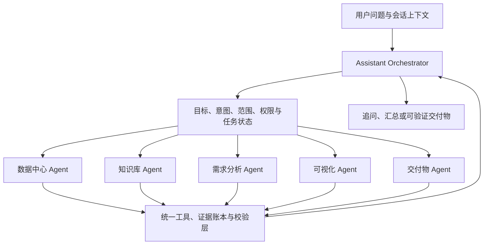

# VISSLM AI 助手产品重构方案

## 结论

VISSLM 当前不应该被设计成“另一个聊天框”，而应该被设计成一个以本地数据为事实来源的 Agent 工作台：用户提出业务问题，Agent 负责拆解任务、选择正确的数据工具、执行可验证查询、返回结论并附上可核验依据。

本次重构的目标不是让模型说得更像人，而是让用户在每一次任务中都能回答四个问题：

1. 它是否理解了我的问题？
2. 它正在执行什么步骤？
3. 这个结论来自哪些数据？
4. 如果失败，我下一步应该怎么处理？

## 全局重构基线 v2

本轮重构不再通过增加特定问法正则或放大 Top-K 修补单个问题。AI 助手统一采用以下执行链：

`分类 → 来源与范围确认 → 受约束计划 → 工具执行 → 证据账本 → 程序校验 → 回答或交付物`

正则只允许用于高置信实体抽取或显式任务提示，不能单独决定数据范围、工具、结果数量或答案。系统不承诺所有问题都有答案；权限不足、范围或字段含糊、知识索引不可用、证据不完整时必须 fail-closed，返回原因和可执行的恢复建议。

### Agent 控制层 v3

AI 助手不能把“识别到需要数据”当作完成了意图理解。每一轮自动模式请求必须先产生并校验 `AssistantIntentDecision`，在此之前禁止读取字段目录、检索知识库或执行任何业务技能：

| 决策字段 | 含义 |
| --- | --- |
| `taskType` | 对话、记录查询、知识问答、混合分析、可视化或需求匹配 |
| `skillId` | 从已注册技能中选择的唯一执行器 |
| `sourceMode` | 无来源、数据中心、知识库或混合来源 |
| `resolvedQuestion` | 结合最近对话消解指代后的独立任务描述 |
| `resultMode` | 回答、平铺列表、分组列表、表格或 Dashboard |
| `groupEntities` | “分别、各自”等交付要求对应的已落地实体 |
| `needsClarification` | 缺失范围、实体或交付形态时停止执行并追问 |

`resolvedQuestion` 和 `groupEntities` 中新增的实体必须能在当前问题或用户历史中找到依据；模型不得凭空增加姓名、编号、项目或字段。显式 `@专家`、Dashboard 入口和可校验的精确编号允许确定性优先，但普通自动模式不得通过关键词表直接选择数据查询。

Agent 生命周期统一为：

`理解目标 → 消解上下文 → 选择技能 → 制定计划 → 执行工具 → 校验证据 → 形成交付物 → 记录可恢复状态`

阶段状态必须反映真实控制流程。界面显示“选择技能”时必须已经有具体技能；显示“扫描数据”时必须已经通过意图、来源、字段和权限校验。不得用“识别任务”标签掩盖实际上已经开始的数据访问。

多轮任务不能只保存自然语言消息，还必须保存经过验证的目标、实体、来源、结果形态和上次执行引用。用户说“分别列出，不要放一起”时，系统需要继承上一轮已出现的对象，将结果规划为 `grouped_list`，并在查询结果和交付物中保持分组；不能再次返回混合平铺列表。

### Assistant Orchestrator 架构

VISSLM 不建设一个同时承担理解、检索、统计、匹配、绘图和文档生成的“万能 Agent”。顶层采用 Assistant Orchestrator，专业任务交给边界清晰的执行 Agent：

Assistant Orchestrator 只承担六类责任：理解用户目标、消解多轮上下文、选择专业 Agent、冻结来源与权限、维护可恢复任务状态、校验并汇总交付结果。它不能直接绕过专业 Agent 查询业务数据，也不能把模型生成的实体、字段或来源当作已验证事实。

专业 Agent 的目标边界如下：

| Agent | 职责 | 允许来源 | 典型交付 |
| --- | --- | --- | --- |
| 数据中心 Agent | 字段检查、筛选、聚合、分组、排序、明细和记录分析 | 授权数据中心记录 | 结论、表格、分组列表、分页数据视图 |
| 知识库 Agent | 文档检索、跨文档归纳、制度与说明问答 | 已索引文档分块 | 带文档定位的答案、摘要、对比 |
| 需求分析 Agent | 精确需求读取、相似匹配、差异和关联分析 | 需求记录与专用索引 | 匹配清单、评分证据、分析报告 |
| 可视化 Agent | QuerySpec 规划、Dashboard 生成和迭代修改 | 已验证结构化查询结果 | DashboardSpec、图表和版本变更 |
| 交付物 Agent | 将已验证证据转成文件或可分享成果 | 上游 Agent 的证据账本 | 表格、报告、演示文稿或导出包 |

多 Agent 不是让多个模型自由讨论。Orchestrator 必须用结构化契约调用唯一主 Agent；确需跨源时，按计划调用有限的专业 Agent，并用统一证据账本合并。每个 Agent 都声明输入/输出 schema、允许工具、权限范围、上下文预算、失败条件和幂等策略。任务含写操作时，必须在执行前增加影响预览与用户确认。

相较当前实现，落地顺序为：先把 `AssistantIntentDecision` 固化为 Orchestrator 入口；再把通用执行器拆成数据中心与知识库 Agent；随后增加统一技能注册表和任务状态存储；最后接入交付物 Agent、写操作确认、暂停/恢复与跨 Agent 证据汇总。

#### 第二阶段工程契约

第二阶段将“选择了什么技能”和“实际由谁执行”分开建模。`skillId=general` 只代表用户入口与兼容技能，不代表一个拥有所有工具的万能执行器。Orchestrator 必须根据已验证的任务和来源解析具体执行 Agent：

| 任务/来源 | 主执行 Agent | 可参与 Agent |
| --- | --- | --- |
| `conversation/conversation` | `conversation` | 无 |
| `record_query/records` | `data-center` | 无 |
| `knowledge_qa/knowledge` | `knowledge-base` | 无 |
| `mixed_analysis/mixed` | `data-center` | `knowledge-base` |
| `requirement_matching/records` | `requirement-analysis` | 无 |
| `visualization/records` | `visualization` | 无；其内部只允许调用已注册的 QuerySpec 工具 |

统一执行 Agent 注册项必须声明：稳定 ID、名称、版本、支持的任务类型、允许来源、只读属性、能力、允许工具和失败边界。Orchestrator 只能调用注册表允许的组合；任务、来源、Agent 或工具不匹配时在执行前失败，不能回退成通用数据查询。

每轮请求生成结构化 `AssistantTaskTrace`，随回答和会话消息保存，至少记录：运行 ID、状态、主 Agent、实际参与 Agent、任务类型、来源、结果形式、开始和完成时间，以及可选澄清或错误。该轨迹是 UI、审计和恢复的事实来源，不允许从状态文案或回答正文反推。澄清任务的参与 Agent 必须为空；只有真正完成证据校验的任务才能标记为完成。

专业 Agent 必须拥有真实执行边界：数据中心 Agent 负责字段目录、结构化查询、统计、分组和 `ChatDataView`；知识库 Agent 负责文档检索、证据预算和文档来源隔离。Orchestrator 负责编排与汇总，不能继续把两类执行代码隐藏在一个通用类的私有方法中。混合任务分别调用两个 Agent，并在缺失任一来源时保留覆盖缺口。

第二阶段验收包括：

- `records` 只调用数据中心 Agent，`knowledge` 只调用知识库 Agent，`conversation` 不调用证据 Agent；
- `mixed` 调用两个专业 Agent，且记录和文档来源身份不丢失；
- 澄清发生在任何专业 Agent、数据库或索引访问之前；
- 每个完成、澄清和失败任务都有与实际调用一致的结构化任务轨迹；
- 会话刷新后仍能显示主 Agent、参与 Agent 与任务状态；
- 上一阶段的分组、全量匹配、分页、UID 上下文边界和 fail-closed 回归继续通过。

### 能力矩阵

| 任务类型 | 权威来源 | 主要能力 | 交付形式 | 失败策略 |
| --- | --- | --- | --- | --- |
| `conversation` | 无本地来源 | 闲聊、解释、改写、方法建议 | 文本 | 不擅自声称已查询本地数据 |
| `records` | 数据中心 | 字段查询、全量计数、筛选、分组、排序、明细和记录分析 | 结论、`ChatDataView`、分页 | 字段或范围不明时追问或拒答 |
| `knowledge` | 知识库文档 | 文档召回、摘要、问答和制度说明 | 带文件定位的答案 | 召回不足或索引不可用时明确说明 |
| `mixed` | 数据中心 + 知识库 | 事实数据与制度、规范或说明对照 | 分源证据、数据明细、综合结论 | 没有可靠关联条件时不得强行合并 |
| `expert` | 已注册内置专家 | 需求相似匹配、可视化等专业流程 | 专家结构化结果 | 未注册、参数缺失或越权时拒绝执行 |
| `artifact` | 上述已验证证据 | 表格、图表、Dashboard、报告草稿 | 可查看、可追溯交付物 | 写操作默认禁止，必须预览并确认 |

### 来源和范围选择

来源选择按以下优先级执行：

1. 用户显式指定的来源、`@专家`、当前页面入口或选中数据范围；
2. 数据中心记录、字段、数量、筛选、负责人等事实任务选择 `records`；
3. 知识库、文件、制度、说明、规范或引用依据选择 `knowledge`；
4. 用户明确要求对照两类来源，或受约束计划证明需要跨源，选择 `mixed`；
5. 不需要本地事实时选择 `conversation`。

执行前必须冻结并记录实际范围：项目、节点类型、授权记录、指定文档、字段、实体、时间、状态条件以及范围版本。权限过滤必须先于检索、统计和模型调用。

### 统一计划和工具契约

统一计划至少包含：

- 任务类型和来源类型；
- 生效的数据范围与权限边界；
- 已通过字段目录校验的字段、实体、过滤、分组和排序；
- 全量扫描、聚合、记录检索、文档检索或交付物生成操作；
- 返回上限、分页或范围快照策略；
- 选中的技能、允许工具、证据要求和失败条件；
- 是否需要用户澄清，以及唯一、具体的澄清问题。

工具结果必须区分 `scannedCount`、`matchedCount`、`returnedCount`、分组、记录或文档、是否截断、分页信息、范围快照、警告和错误。`returnedCount < matchedCount` 时必须明确显示分页或预算截断，不得把当前页描述为全部结果。

### 数据中心、知识库和语义召回边界

- 数据中心的计数、列举、分别、各自、每人、筛选、分组和排序必须在授权范围内扫描完整候选集合，再由程序执行字段运算；语义 Top-K 不能代替全量统计。
- 知识库问答只使用文档分块；数据中心记录向量和知识文档向量即使共用索引，也必须在检索前按来源隔离。
- 语义召回只负责候选排序，不能独立证明事实，也不能把“未进入 Top-K”解释为记录不存在。
- 混合任务分别执行数据中心工具和知识文档检索，在证据账本中保留 `record` / `document` 来源类型，缺少任一来源时必须说明覆盖缺口。
- 人名出现在标题或全文中只能证明内容命中，不能自动推断为负责人；字段别名必须来自真实 schema、显示名或已配置词典，歧义时追问。

### 四种上限独立治理

以下边界必须分别配置和审计，禁止复用一个 `limit`：

1. 数据池候选扫描范围；
2. 查询结果首屏和分页大小；
3. 模型上下文证据预算；
4. UI 回答引用展示数量。

模型只接收统计、分组摘要、当前页和必要证据块；完整结果通过稳定 UID 集合或查询快照进入 `ChatDataView` 分页。所有事实引用必须绑定真实记录 UID 或文档 ID、chunk 和可用的页码/工作表定位。

文档证据预算不再固定为 8：简单问答默认 8，跨文档汇总、对比或清单由来源规划器在 4–20 条范围内选择。该预算只限制送入回答模型的证据，不限制知识库候选扫描；记录全集则始终由结构化查询的 `matchedCount` 和分页索引表达。

### 内置技能注册与选择

现有通用数据助手、需求分析专家和数据可视化专家作为兼容技能保留。目标注册契约包含：技能 ID、版本、任务类型、能力、允许来源、允许工具、输入/输出 schema、只读属性、限制和校验规则。

技能选择顺序固定为：

`显式 @专家 → 页面入口 → 高置信任务类型 → 来源与范围 → 候选技能能力校验`

同分、参数冲突或副作用不明确时必须追问。未注册工具不能执行；修改数据、推送业务平台等写操作必须先显示影响范围和变更预览，再获得明确确认。

### 证据、校验与失败恢复

回答前至少校验：范围与权限、字段存在性、过滤条件是否实际执行、计数/分组/去重、分页稳定性、引用覆盖、上下文预算和交付物只读边界。完整模型 reasoning 不作为证据。

统一失败类别包括：需要范围、权限拒绝、字段或实体歧义、不支持的操作、索引不可用、查询失败、证据不完整、分页过期、预算超限和写入待确认。失败不得降级成无依据的普通回答；应保留原问题和计划，提供补充字段、缩小范围、重试、重建索引或切换来源等恢复动作。

### 分阶段实施

- **P0，统一编排**：单一分类和计划入口、`conversation/records/knowledge/mixed` 来源选择、来源隔离、澄清协议、证据预算和 fail-closed。
- **P1，记录查询闭环**：字段别名、多人 OR、分组/去重/零结果、完整 UID 集合、稳定分页和全量统计真值。
- **P2，知识与混合取证**：文档定位引用、跨源证据账本、来源缺口说明和混合分析校验。
- **P3，技能与交付物**：统一技能注册表、自动技能能力校验、artifact 预览确认、审计和离线评测。

### 全局验收标准

- 每个请求稳定落入一个任务类型和一个可审计的来源计划。
- 结构化计数和集合结果与授权范围内的数据库真值一致，不受语义 Top-K 限制。
- 字段缺失或歧义时停止执行并提出具体问题，不编造字段映射。
- 51 条及以上结果保留总数并可分页，翻页无重复、无遗漏。
- 知识问答只引用文档，记录问答只引用记录；混合回答保留两类真实来源。
- 每个数据事实都能打开对应记录或文档位置；无证据结论为零。
- 模型上下文有硬预算，完整数据不直接进入提示词。
- 显式专家优先，自动技能选择不能越过工具、来源、权限和只读边界。
- 连接失败、索引缺失、空结果、工具失败和澄清请求都有可恢复状态。
- TypeScript、聊天会话、RAG、需求分析、项目管理和新增全局编排回归检查全部通过。

## 现状诊断

### 1. 能力存在，但产品入口没有暴露能力边界

当前已经有结构化查询计划、知识库检索、字段画像、数据明细、记录详情和可视化专家，但首屏主要是一个输入框和三张静态提示卡。用户不知道：

- 当前模型是否可用；
- 当前本地是否有可查询记录；
- 普通问答、结构化统计、知识库问答和大屏生成分别适合什么问题；
- 回答失败时是模型连接失败、索引缺失、字段不匹配，还是查询没有命中。

这会把配置问题、数据问题和模型问题混成“AI 不好用”。

### 2. 执行过程只对可视化 Agent 可见

可视化 Agent 已经有阶段事件，通用数据 Agent 只有一次 IPC 请求。结构化查询往往至少包含字段目录读取、计划生成、查询执行和答案整理，用户在较慢的本地模型上只能看到一个笼统的“正在思考”。

### 3. 错误不能恢复

普通 Agent 抛出异常后由渲染层拼接错误文本；用户需要自己把原问题重新输入。失败请求还可能污染后续上下文，导致下一轮继续沿用失败结论。

### 4. 结果核验入口不够强

虽然已经支持查看查询数据和回答依据，但它们是回答末尾的弱入口，没有成为每次数据回答的固定“证据区”。原始 JSON 也默认展开，影响阅读，并让详情浮层承担了过多低频信息。

## 产品定位

### 产品名称

VISSLM Evidence Agent：面向 VISSLM 本地资产的证据优先数据 Agent。

### 核心承诺

> 先取证，再回答；先验证，再生成。

Agent 可以做：

- 记录、正文、编号和字段检索；
- 总量、类型、项目和业务字段聚合；
- 条件筛选、排序、排名和空值检查；
- 基于知识库资料的有引用问答；
- 基于当前数据范围生成可追溯、可编辑的大屏；
- 对上一轮结果做明确的追问和结果核验。

Agent 不应该做：

- 在没有查询证据时猜测数量或字段值；
- 把字段样例当成真实记录结论；
- 把上传文档和结构化记录混为一种来源；
- 未经用户确认直接修改本地数据或推送业务平台；
- 用一段“模型思考”替代执行状态和结果依据。

## 目标用户任务流

### 流程 A：数据问答

1. 用户从“统计、检索、字段结构、知识库问答”中选择一个起手任务，或直接输入自然语言。
2. 页面先显示模型服务和数据资产状态。
3. Agent 发送阶段状态：理解需求 → 检索依据 → 规划查询 → 执行查询 → 核对结果 → 整理回答。
4. 回答先给结论，再给统计口径、引用和“查看查询数据”。
5. 用户点击记录或文档来源查看详情；详情保持当前会话上下文，原始 JSON 默认折叠。
6. 失败回答保留原问题，并提供“重试本次任务”。

### 流程 B：可视化任务

1. 从资产中心选择数据范围，进入 AI 助手时自动保留范围上下文。
2. 输入区明确显示当前范围和已附加大屏。
3. Agent 沿用已有可视化专家的字段画像、查询执行、校验和版本产物流程。
4. 生成或修改结果进入可视化大屏，不在聊天消息中伪装成最终交付物。

### 流程 C：模型或数据不可用

页面必须把问题分成可操作的状态：

- 模型离线：跳转系统配置；
- 没有数据：跳转数据采集；
- 知识库未建索引：跳转知识库；
- 查询未命中：保留问题，建议调整条件；
- 查询执行失败：显示失败阶段，允许重试；
- 结果可疑：显示证据不足，不生成确定性结论。

## Agent 运行架构

### 路由层

保留显式专家路由，但将路由原因和当前上下文作为运行信息：

- `general`：检索、统计、字段和知识库问答；
- `visualization`：字段画像、QuerySpec、大屏生成和补丁修改。

自然语言理解不能只依赖一次大模型分类。高风险数据意图采用“确定性识别优先、模型规划补充”的混合路由：

- 对业务编号、相似查询、统计、排序、字段筛选等可明确归一化的表达，先解析为受约束意图；
- 解析到业务编号后必须精确定位记录，编号不存在时直接返回，不得降级为宽泛 RAG；
- 缺少比较基准、字段或范围时先要求补充，不允许模型自行猜测；
- 未命中高风险意图的开放问题再进入知识库检索或模型计划。

### 需求分析专家的分层匹配

“经过大模型思考”不等于直接采用模型生成的分数。需求分析专家将检索、排序、判定和解释分离：

1. 根据编号精确定位基准记录，读取完整清洗原文；已就绪且签名有效的 AI 语义卡片只作为结构化增强，查询阶段不生成临时卡片。
2. 在当前 embedding 索引的全部可读记录中执行 Dense、SQLite FTS5/BM25 和有效语义卡片结构化召回，通过 RRF 合并候选。
3. 使用本地 Cross-Encoder 重排前 20 条，再由程序基于重排分、可用语义维度和动作/对象硬规则计算关系与综合匹配度。
4. 仅对最终确定性 Top 10 执行一次批量 AI 解释。模型只能返回相似点、差异和双方原文证据编号，不能返回或修改关系、分数和候选集合。
5. 程序严格校验 UID、覆盖范围、JSON schema 和原文证据。解释失败时保留确定性结果并明确标记解释不可用；只有完整通过校验的解释才写入匹配结论缓存。

模型内部 reasoning 不直接展示。用户看到的是经过复核的结论、证据、主要相同点和差异，以及可打开的真实记录明细。

相似记录查询的固定执行链路为：

`意图归一化 → 编号精确定位 → 全量 Dense/BM25/结构化召回 → RRF → Cross-Encoder Top20 → 确定性评分 → Top10 批量解释 → 程序校验 → 答案与 ChatDataView`

### 计划层

结构化问题必须先读取真实字段目录，再产出受字段枚举约束的计划。计划至少包含：

- 意图；
- 记录类型；
- 搜索词和匹配模式；
- 字段过滤；
- 需要返回的字段；
- 聚合字段和排序；
- 结果上限。

### 工具层

工具只返回可序列化的事实结果，并由 Agent 生成 `ChatDataView` 和 `ChatSource`。所有数据型回答都必须满足：

- 查询结果中的计数优先于模型自行计算；
- 引用使用真实 `source.uid`；
- 字段画像不能作为记录属性的最终证据；
- 空结果必须明确标注查询口径。

### 验证层

回答前检查：

- 是否调用了与问题类型匹配的证据工具；
- 是否混用了上一轮失败上下文；
- 是否把技术字段误当业务字段；
- 是否输出了查询结果中不存在的数值或属性；
- 是否附带数据明细或来源入口。

### 运行状态层

通用 Agent 使用统一阶段事件：

| 阶段 | 用户可见含义 |
| --- | --- |
| `route` | 判断问题类型和专家 |
| `retrieve` | 查找知识库或数据依据 |
| `plan` | 读取字段目录并生成查询计划 |
| `query` | 执行本地查询或聚合 |
| `verify` | 核对结果和回答口径 |
| `reason` | 大模型深度分析真实证据 |
| `critique` | 独立复核结论和证据一致性 |
| `answer` | 整理回答和引用 |
| `error` | 任务在明确阶段中断，可重试 |

## 本轮已落地

- AI 助手首屏改为任务优先的工作台，显示模型服务、记录数和知识索引状态。
- 增加统计、变更检索、图片统计和字段结构四类起手任务。
- 通用 Agent 增加阶段状态事件，并通过 Electron IPC 发送到当前会话。
- 普通 Agent 失败改为结构化可恢复响应，不再把异常直接变成不可操作的请求失败。
- 失败回答保留原问题并提供一键重试；所有回答增加复制入口。
- 数据范围和已附加大屏在输入区成为显式上下文。
- 原始记录 JSON 改为详情浮层内默认折叠，并保持主题变量和内部滚动。
- AI 助手新样式覆盖暗色和亮色主题，窄窗口下历史栏、任务卡和上下文标签可收缩。
- 由 `@需求分析专家` 接管需求编号相似匹配，支持“和编号差不多的需求有哪些”等自然语言表达；匹配阶段使用全量混合召回、Cross-Encoder 重排、确定性评分和一次批量 AI 解释。
- 相似查询精确定位基准记录，排除本次输入的全部基准 UID；其他记录类型不预先排除，是否匹配由完整原文、重排和确定性业务规则共同决定。
- 需求匹配要求模型只负责生成经过 UID、schema 和原文证据校验的相似点与差异解释；关系和综合匹配度由程序确定性计算，缓存命中后不重复调用解释模型。资产中心语义卡片仍保留独立的三阶段 AI 生成流程。推理传输参数按已知供应商能力发送，通用 OpenAI 兼容服务只使用标准请求字段，不猜测其支持 `reasoning_effort` 等扩展参数。
- 相似结果使用真实 UID、业务编号、节点类型和名称，并同时展示 Dense/BM25/结构化召回分、Cross-Encoder 重排分、确定性评分明细和 AI 解释状态。
- 增加失败关闭校验：模型新增 UID、遗漏/重复候选、证据不在原文或 schema 不符合时不写入解释缓存；确定性评分结果仍按可见关系和解释状态明确展示。
- 模型状态检查分为两级：首页自动检查只访问模型目录，不触发计费问答；设置页手动“测试模型”额外执行不含业务数据的最小问答，能够识别“模型目录可访问但聊天权限未开通”的半连通状态。

## 后续路线图

### P0：保证可用

- 增加请求取消：为每次 Agent 任务分配 `runId`，支持停止本地模型请求并清理状态。
- 增加真实流式回答：先展示阶段状态，随后增量展示最终答案；不把内部 reasoning 原文展示给用户。
- 模型配置增加“连接测试 + 最小问答测试”，区分地址、模型、Key、工具调用和结构化输出能力。
- 对本地模型能力做启动探测：JSON Schema、tool calling、上下文长度和思考模式分别标记。
- 增加无数据、索引中、索引失败的明确 CTA 和状态刷新。

### P1：提升任务成功率

- 将计划展示为可折叠的“执行摘要”：检索词、字段、筛选条件和数据范围可在执行前确认。
- 为常用业务字段建立语义词典和人工纠正入口，减少“负责人/来源/状态”等字段映射错误。
- 对查询失败提供安全改写建议，例如缩小时间范围、确认字段名或切换“正文检索”。
- 将回答依据抽象为固定的 EvidenceBlock，统一文档、记录、聚合和查询明细的入口。
- 支持会话级项目范围和数据范围，但每次回答仍显示实际生效范围。

### P2：从问答走向 Agent

- 在用户确认后提供只读之外的操作：创建分析快照、保存筛选视图、生成报告草稿。
- 所有写操作先生成变更预览、影响范围和回滚点，禁止模型直接提交。
- 增加任务运行历史、耗时、工具调用、命中数和失败阶段统计，用于产品迭代。
- 建立离线评测集：总量、业务字段统计、属性问答、空结果、歧义问题、提示注入和错误字段。

## 验收指标

### 功能指标

- 连接失败、索引缺失、无数据、空结果、工具失败均有明确可操作入口。
- 失败任务可以不重新输入问题直接重试，且失败内容不进入有效上下文。
- 数据型回答 100% 能打开至少一个依据或查询明细入口；无证据时不输出确定性数据结论。
- 在 1200px、1000px、760px 和 680px 附近，输入区和任务卡不被裁切，详情内容只在浮层内部滚动。

### 质量指标

- `npm run typecheck` 通过。
- `npm run smoke:chat-sessions` 通过。
- `npm run smoke:agent-rag-fallback` 通过。
- `npm run smoke:agent-similarity` 通过。
- `npm run smoke:project-management` 和项目管理 UI smoke 通过。
- 暗色和亮色主题下，AI 工作台不出现与主题冲突的白色或浅蓝色内容块。

## 迭代原则

每增加一个 Agent 能力，必须同时增加三件东西：

1. 一个真实的任务入口或可发现的操作；
2. 一个可核验的结果或来源；
3. 一个可恢复的失败路径。

只有模型回答变长、提示词变复杂，而用户仍然不知道任务状态和证据来源，不算产品能力提升。
